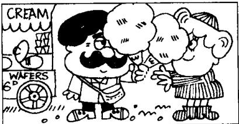
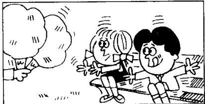
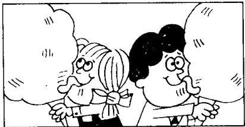
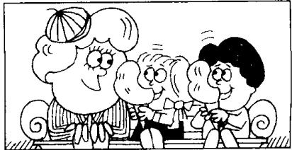

## Lesson 19 Tired and thirsty 又累又渴

Listen to the tape then answer this question.

Why do the children thank their mother?

听录音，然后回答问题。为什么孩子们向母亲致谢？

MOTHER: What's the matter, children?

GIRL: We're tired...

BOY : ... and thirsty, Mum.

MOTHER : Sit down here.

MOTHER : Are you all right now?

BOY: No, we aren't.

MOTHER: Look! There's an ice cream man.

MOTHER : Two ice creams please.

MOTHER : Here you are, children.

CHILDREN : Thanks, Mum.

GIRL : These ice creams are nice.

MOTHER : Are you all right now?

CHILDREN: Yes, we are, thank you!

## New words and expressions 生词和短语

matter /'mætə/ n. 事情

Mum /mʌm/ n. 妈妈（儿语）

children /'tʃɪldrən/ n. 孩子们 (child 的复数)

sit down /'sɪt-daʊn/ 坐下

tired /taɪəd/ adj. 累，疲乏

right /raɪt/ adj. 好，可以

boy /bɔɪ/ n. 男孩

thirsty /'θɜːsti/ adj. 渴

ice cream /'aɪs-'kriːm/ 冰淇淋

## Notes on the text 课文注释

1 What's the matter? = Tell me what's wrong. 怎么啦?

2 There's = There is.

## 参考译文

母亲：怎么啦，孩子们？

女孩：我们累了……

男孩：……口也渴，妈妈。

母亲：坐在这儿吧。

母亲：你们现在好些了吗？

男孩：不，还没有。

母亲：瞧！有个卖冰淇淋的。

母亲：请拿两份冰淇淋。

母亲：拿着，孩子们。

孩子们：谢谢，妈妈。

女孩：这些冰淇淋真好吃。

母亲：你们现在好了吗？

孩子们：是的，现在好了，谢谢您！
