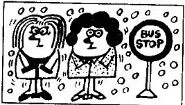
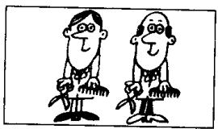
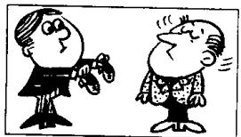
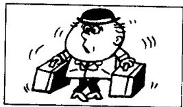
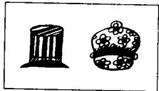

# Lesson 20 Look at them! 看看他/它们!

Listen to the tape and answer the questions.
听录音并回答问题。

105

  
They're clean.  
106

  
They're dirty.  
217

  
They're hot.  
218

  
They're cold.  
321

  
They're fat.  
322

  
They're thin.  
433

  
They're big.  
434

  
They're small.  
545

  
They're open.  
546

  
They're shut.  
657

  
They're light.  
658

  
They're heavy.  
769

  
They're old.  
770

  
They're young.

  
They're old.  
882

  
They're new.  
998

  
They're short.  
999

  
They're tall.  
1,000

  
They're short.  
1,001

  
They're long.

## New words and expressions 生词和短语

big /big/ adj. 大的

heavy /'hevi/ adj. 重的

small /smɔːl/ adj. 小的

long /lɒŋ/ adj. 长的

open /'əʊpən/ adj. 开着的

shut /ʃʌt/ adj. 关着的

shoe /ʃuː/ n. 鞋子

light /laɪt/ adj. 轻的

grandfather /'grændˌfɑːðə/ n.-祖父，外祖父

grandmother /'græn,mʌðə/ n. 祖母，外祖母

## Written exercises 书面练习

A Complete these sentences using am, is or are.

抄写以下句子，用 am, is 或 are 填空。

Example:

Those children \_\_\_\_ thirsty.

Those children are thirsty.

1 Those children \_\_\_\_ tired.

2 Their mother \_\_\_\_ tired, too.

3 That ice cream man \_\_\_\_ very busy.

4 His ice creams \_\_\_\_ very nice.

5 What's the matter, children? We \_\_\_\_ thirsty.

6 What's the matter, Tim? I \_\_\_\_ tired.

## B Write questions and answers.

模仿例句提问并回答。

## Example:

his shoes/(dirty)/clean

Are his shoes dirty or clean?

They're not dirty. They're clean.

1 the children/(tired)/thirsty

2 the postmen/(cold)/hot

6 his cases/(heavy)/light

7 grandmother and grandfather/(young)/old

3 the hairdressers/(thin)/fat

4 the shoes/(small)/big

8 their hats/(old)/new

5 the shops/(shut)/open

9 the policemen/(short)/tall

10 his trousers/(short)/long
