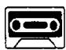
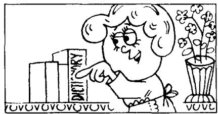

## Lesson 21 Which book? 哪一本书?

Listen to the tape then answer this question.

Which book does the man want?

听录音，然后回答问题。这位男士要哪本书？

MAN : Give me a book please, Jane.

WOMAN : Which book?

WOMAN : This one?

MAN : No, not that one. The red one.

WOMAN : This one?

MAN : Yes, please.

WOMAN : Here you are.

MAN: Thank you.

## New words and expressions 生词和短语

give /gɪv/ v. 给

which /wɪtʃ/ question word 哪一个

one /wʌn/ pron. 一个

## Notes on the text 课文注释

1 Give me a book, please.

这是祈使句，省略了主语 you。

2 Which book? 哪一本？这是一种省略形式。

3 This one? 句中的 one 是不定代词，表示 book。复数形式是 ones。

## 参考译文

丈夫：请拿本书给我，简。

妻子：哪一本？

妻子：是这本吗？

丈夫：不，不是那本。是那本红皮的。

妻子：这本吗？

丈夫：是的，请给我。

妻子：给你。

丈夫：谢谢。
