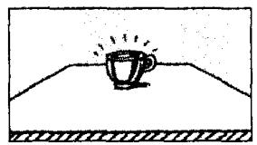
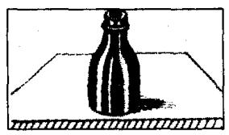
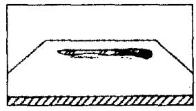
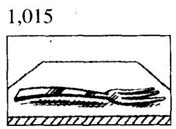

## Lesson 22 Give me/him/her/us/them a . . .

Which one?

给我／他／她／我们／他们一……

哪一……？

Listen to the tape and answer the questions.
听录音并回答问题。

1,001

  
(dirty)  
1,002

  
(clean)  
1,003

  
(empty)  
1,004

  
(full)  
1,005

  
(large)  
1,006

  
(small)  
1,007

  
(big)  
1,008

  
(little)  
1,009  
(new)

  
1,010

  
(old)  
1,011

  
(sharp)  
1,012

  
(blunt)  
1,013  
(new)

  
1,014

  
(old)  
1,015

  
(large)  
1,016

  
(small)

## New words and expressions 生词和短语

empty /'empti/ adj. 空的

box /bɒks/ n. 盒子，箱子

full /ful/ adj. 满的

glass /gla:s/ n. 杯子

large /la:dʒ/ adj. 大的

cup /kʌp/ n. 茶杯

little /'lɪtl/ adj. 小的

bottle /'botl/ n. 瓶子

sharp /ʃɑːp/ adj. 尖的，锋利的

tin /tɪn/ n. 罐头

small /smɔːl/ adj. 小的

big /big/ adj. 大的

knife /naɪf/ n. 刀子

blunt /blʌnt/ adj. 钝的

fork /fɔːk/ n. 叉子

spoon /spuːn/ n. 勺子

## Written exercises 书面练习

A Complete these sentences using His, Her, Our or Their.
完成以下句子，用 His, Her, Our 或 Their 填空。

Example:

Is this Tim's shirt? No, it's not. \_\_\_\_ shirt is white.

Is this Tim's shirt? No, it's not. His shirt is white.

1 Is this Nicola's coat? No. it's not. \_\_\_\_ coat is grey.

2 Are these your pens? No, they're not. \_\_\_\_ pens are blue.

3 Is this Mr. Jackson's hat? No, it's not. \_\_\_\_ hat is black.

4 Are these the children's books? No, they're not. \_\_\_\_ books are red.

5 Is this Helen's dog? No, it's not. \_\_\_\_ dog is brown and white.

6 Is this your father's tie? No, it's not. \_\_\_\_ tie is orange.

## B Write questions and answers.

模仿例句写出相应的对话。

Example:

book/(this blue)/that red

Give me a book please.

Which one? This blue one?

No, not this blue one. That red one.

Here you are.

Thank you.

1 cup/(this dirty)/that clean

5 tin/(this new)/that old

2 glass/(this empty)/that full

6 knife/(this sharp)/that blunt

3 bottle/(this large)/that small

7 spoon/(this new)/that old

4 box/(this big)/that little

8 fork/(this large)/that small
