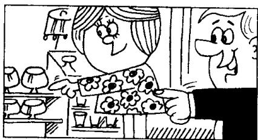

## Lesson 23 Which glasses? 哪几只杯子?

Listen to the tape then answer this question.

Which glasses does the man want?

听录音，然后回答问题。这位男士要哪些杯子？

MAN : Give me some glasses please, Jane.

WOMAN : Which glasses?

WOMAN : These glasses?

MAN : No, not those.
The ones on the shelf.

WOMAN: These?

MAN : Yes, please.

WOMAN : Here you are.

MAN: Thanks.

## New words and expressions 生词和短语

on /ɒn/ prep. 在……之上

shelf /ʃelf/ n. 架子，搁板

## Notes on the text 课文注释

1 在 Give me some glasses 中，动词 give 后面有两个宾语，即直接宾语 some glasses 和间接宾语 me。人称代词作宾语时要用人称代词的宾格。如：me (I 的宾格)，us (we 的宾格)，you (you 的宾格)，him (he 的宾格)，her (she 的宾格)，them (they 的宾格) 和 it (it 的宾格）。

2 No, not those.

句中 those 是指 those glasses。

3 The ones on the shelf.

本句是省略句。句中的 ones 代表 glasses。

## 参考译文

丈夫：请拿给我几只玻璃杯，简。

妻子：哪几只？

妻子：是这几只吗？

丈夫：不，不是那几只。是架子上的那几只。

妻子：这几只？

丈夫：是的，请拿给我。

妻子：给你。

丈夫：谢谢。
