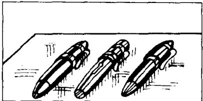
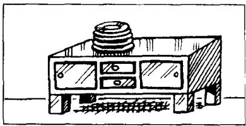
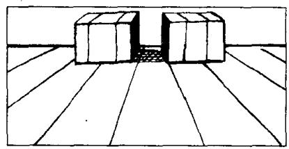

# Lesson 24 Give me/him/her/us/them some . . . Which ones?

给我／他／她／我们／他们一些……

哪些？

Listen to the tape and answer the questions.

听录音并回答问题。

1,117

  
pens/on the desk  
1,218

  
ties/on the chair  
1,319

  
spoons/on the table  
1,420

  
plates on the cupboard  
1,521

  
cigarettes/on the television  
1,622

  
boxes/on the floor  
1,723

  
bottles/on the dressing table  
1,824

  
books/on the shelf  
1,925

  
magazines/on the bed  
2,000

  
newspapers/on the stereo

## New words and expressions 生词和短语

desk /desk/ n. 课桌

floor /floː/ n. 地板

table /'teɪbl/ n. 桌子

dressing table /'dresɪŋ-ˈteɪbl/ 梳妆台

plate /pleɪt/ n. 盘子

magazine /mægə'ziːn/ n. 杂志

cupboard /'kʌbəd/ n. 食橱

bed /bed/ n. 床

cigarette /ˌsɪɡəˈreɪt/ n. 香烟

television /'telɪˌvɪʒən/ n. 电视机

newspaper /'nju:speɪpə/ n. 报纸

stereo /'steriəʊ/ n. 立体声音响

## Written exercises 书面练习

A Complete these sentences using me, him, her, us or them.

完成以下句子，用 me, him, her, us 或 them 填空。

## Example:

Give Tim this shirt. Give \_\_\_\_ this one, too.

Give Tim this shirt. Give him this one, too.

I Give Jane this watch. Give \_\_\_\_ this one, too.

2 Give the children these ice creams. Give \_\_\_\_ these, too.

3 Give Tom this book. Give \_\_\_\_ this one, too.

4 That is my passport. Give \_\_\_\_ my passport please.

5 That is my coat. Give \_\_\_\_ my coat please.

6 Those are our umbrellas. Give \_\_\_\_ our umbrellas please.

B Write questions and answers.

模仿例句写出相应的对话。

## Example:

glasses/on the shelf

Give me some glasses please.

Which ones? These?

No. not those. The ones on the shelf.

1 pens/on the desk

6 boxes/on the floor

2 ties/on the chair

7 bottles/on the dressing table

3 spoons/on the table

8 books/on the shelf

4 plates/on the cupboard

9 magazines/on the bed

5 cigarettes/on the television

10 newspapers/on the stereo
