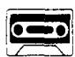
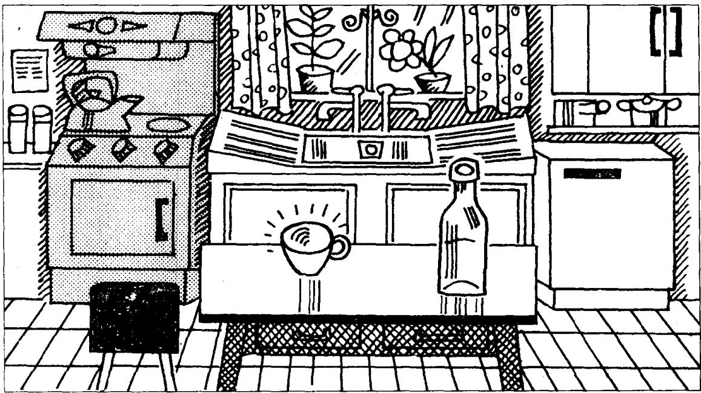

## Lesson 25 Mrs. Smith's kitchen 史密斯太太的厨房

Listen to the tape then answer this question.

What colour is the electric cooker?

听录音，然后回答问题。电灶是什么颜色的？

Mrs. Smith's kitchen is small.

There is a refrigerator in the kitchen.

The refrigerator is white.

It is on the right.

There is an electric cooker in the kitchen.

The cooker is blue.

It is on the left.

There is a table in the middle of the room.

There is a bottle on the table.

The bottle is empty.

There is a cup on the table, too.

The cup is clean.

## New words and expressions 生词和短语

Mrs. /'mɪsɪz/ 夫人

cooker /'kʊkə/ n. 炉子，炊具

kitchen /'kɪtʃən/ n. 厨房

middle /'mɪdl/ n. 中间

refrigerator /rɪˈfrɪdzəreɪtə/ n. 电冰箱

of /əv/ prep. （属于）……的

right /raɪt/ n. 右边

room /ruːm/ n. 房间

electric /ɪ'lektrɪk/ adj. 带电的，可通电的

cup /kʌp/ n. 杯子

left /left/ n. 左边

## Notes on the text 课文注释

1 There is 的结构用来说明人或物的存在，在汉语中可以译为 “有”。这个结构要跟单数名词，句中往往要有一个介词短语来表示位置或地点。

2 on the right (left), 在右边（左边），是介词短语，在本句中作表语。

3 注意不要把 cooker 和 cook 混淆，cooker 是炉子、锅等炊具，不是 “炊事员”。炊事员在英语中是 cook。

4 in the middle of, 在……之间。

5 在课文的第 2 行和第 3 行的名词 refrigerator 前面用了两种不同的冠词：a（不定冠词）和 the（定冠词）。在第 2 行，“冰箱”是第一次提到，是指冰箱这类电器中的一个，因此要用不定冠词 a。当第 2 次提到冰箱时，就不是泛指任何一个冰箱，而是特指第 2 行中的那个冰箱了，因此要用定冠词 the。

## 参考译文

史密斯夫人的厨房很小。

厨房里有个电冰箱。

冰箱的颜色是白的。

它位于房间右侧。

厨房里有个电灶。

电灶的颜色是蓝的。

它位于房间左侧。

房间的中央有张桌子。

桌子上有个瓶子。

瓶子是空的。

桌子上还有一只杯子。

杯子很干净。
