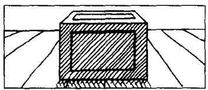
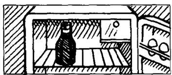
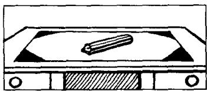
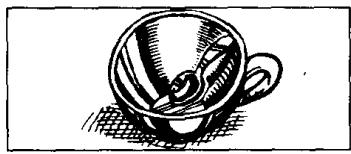

## Lesson 26 Where is it? 它在哪里？

Listen to the tape and answer the questions.

听录音并回答问题。

3,000  
  
There is a cup on the table.
The cup is clean.

4,000  
  
There is a box on the floor.
The box is large.

5,000  
  
There is a glass in the cupboard.
The glass is empty.

6,000  
  
There is a knife on the plate.
The knife is sharp.

7,000  
  
There is a fork on the tin.
The fork is dirty.

8,000  
  
There is a bottle in the refrigerator.
The bottle is full.

9,000  
  
There is a pencil on the desk.
The pencil is blunt.

10,000  
  
There is a spoon in the cup.
The spoon is small.

# New words and expressions 生词和短语

where /weə/ adv. 在哪里

in /ɪn/ prep. 在……里

## Written exercises 书面练习

A Complete these sentences using a or the.

完成以下句子，用 $a$ 或 the 填空。

Example:

Give me \_\_\_\_ book. Which book? \_\_\_\_ book on the table.

Give me a book. Which book? The book on the table.

1 Give me \_\_\_\_ glass. Which glass? \_\_\_\_ empty one.

2 Give me some cups. Which cups? \_\_\_\_ cups on the table.

3 Is there \_\_\_\_ book on \_\_\_\_ table? Yes, there is. Is \_\_\_\_ book red?

4 Is there \_\_\_\_ knife in that box? Yes, there is. Is \_\_\_\_ knife sharp?

B Write sentences using these words.

模仿例句写出相应的句子。

Example:

refrigerator in the kitchen/white

There's a refrigerator in the kitchen.

The refrigerator is white.

1 cup on the table/clean

5 fork on the tin/dirty

2 box on the floor/large

6 bottle in the refrigerator/full

3 glass in the cupboard/empty

7 pencil on the desk/blunt

4 knife on the plate/sharp
