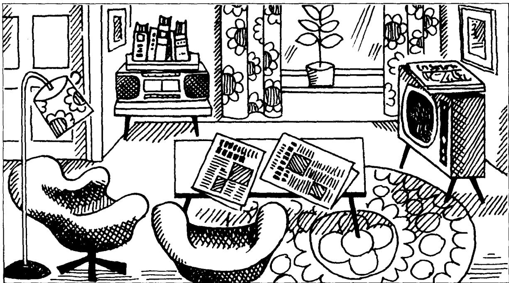

## Lesson 27 Mrs. Smith's living room 史密斯太太的客厅

Listen to the tape then answer this question. Where are the books? 听录音，然后回答问题。书在哪里？

Mrs. Smith's living room is large.

There is a television in the room.

The television is near the window.

There are some magazines on the television.

There is a table in the room.

There are some newspapers on the table.

There are some armchairs in the room.

The armchairs are near the table.

There is a stereo in the room.

The stereo is near the door.

There are some books on the stereo.

There are some pictures in the room.

The pictures are on the wall.

## New words and expressions 生词和短语

living room /'livɪŋ-rʊm/ 客厅

door /dɔː/ n. 门

near /nɪə/ prep. 靠近

picture /'pɪktʃə/ n. 图画

window /'wɪndəʊ/ n. 窗户

armchair /'ɑːmtʃeə/ n. 扶手椅

wall /wɔːl/ n. 墙

## Notes on the text 课文注释

1 There are 的结构中要用复数名词。

2 near the window (door), 靠近窗 (门), 为介词短语。在本句中作表语。

3 on the wall, 在墙上。介词短语作表语。

## 参考译文

史密斯夫人的客厅很大。

客厅里有台电视机。

电视机靠近窗子。

电视机上放着几本杂志。

客厅里有张桌子。

桌上放着几份报纸。

客厅里有几把扶手椅。

这些扶手椅靠近桌子。

客厅里有台立体声音响。

音响靠近门。

音响上面有几本书。

客厅里有几幅画。

画挂在墙上。
