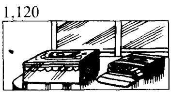
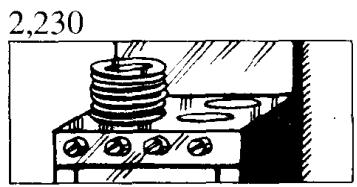
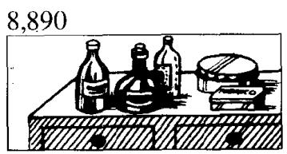
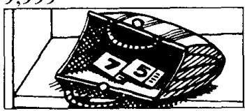
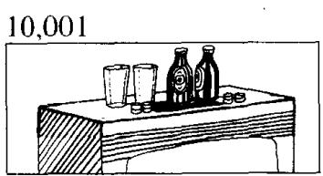

## Lesson 28 Where are they? 它们在哪里？

Listen to the tape and answer the questions.
听录音并回答问题。

  
There are some cigarettes on the dressing table. They are near that box.

  
There are some plates on the cooker. They are clean.

  
There are some trousers on the bed.
They are near that shirt.

  
There are some bottles in the refrigerator.
They are empty.

  
There are some shoes on the floor. They're near the bed.

  
There are some knives on the table. They're in that box.

  
There are some forks on the shelf. They're near those spoons.

  
There are some bottles on the cupboard. They're near those tins.

  
There are some tickets on the shelf. They're in that handbag.

  
There are some glasses on the television. They're near those bottles.

## New words and expressions 生词和短语

trousers traozoz n. (复数) 长裤

## Written exercises 书面练习

A Look at these words.

注意单数名词和复数名词的区别。

Examples:

a book — some books; a man — some men; a housewife — some housewives

Rewrite these sentences using There are.

模仿例句改用 There are 的结构。

## Example:

There is a book on the desk.
There are some books on the desk.

1 There is a pencil on the desk.

2 There is a knife near that tin.

4 There is a newspaper in the living room.

5 There is a keyboard operator in the office.

3 There is a policeman in the kitchen.

B Write sentences using these words.
模仿例句写出相应的对话。

## Example:

(books)/on the dressing table/cigarettes/near that box

Are there any books on the dressing table?

No, there aren't any books on the dressing table.

There are some cigarettes.

Where are they?

They're near that box.

1 (books)/in the room/magazines/on the television

2 (ties)/on the floor/shoes/near the bed

3 (glasses)/on the cupboard/bottles/near those tins

4 (newspapers)/on the shelf/tickets/in that handbag

5 (forks)/on the table/knives/in that box

6 (cups)/on the stereo/glasses/near those bottles

7 (cups)/in the kitchen/plates/on the cooker

8 (glasses)/in the kitchen/bottles/in the refrigerator

9 (books)/in the room/pictures/on the wall

10 (chairs)/in the room/armchairs/near the table

