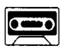

## Lesson 29 Come in, Amy. 进来，艾米。

Listen to the tape then answer this question. How must Amy clean the floor? 听录音，然后回答问题。艾米需要如何来清扫地面？

MRS. JONES : Come in, Amy.

MRS. JONES : Shut the door, please.

MRS. JONES: This bedroom's very untidy.

AMY : What must I do, Mrs. Jones?

MRS. JONES : Open the window and air the room.

MRS. JONES : Then put these clothes in the wardrobe.

MRS. JONES : Then make the bed.

MRS. JONES : Dust the dressing table.

MRS. JONES : Then sweep the floor.

## New words and expressions 生词和短语

shut /ʃʌt/ v. 关门

put /put/ v. 放置

bedroom /'bedrʊm/ n. 卧室

clothes /kləʊðz/ n. 衣服

untidy /ʌn'taɪdi/ adj. 乱，不整齐

wardrobe /'wɔːdrəʊb/ n. 大衣柜

must /mʌst/ modal verb 必须，应该

dust /dʌst/ v. 挥掉灰尘

open /'əʊpən/ v. 打开

sweep /swiːp/ v. 扫

air /eə/ v. 使……通风，换换空气

## Notes on the text 课文注释

1 英文中需用祈使语气来表示直接的命令、建议、告诫、邀请等多种意图。祈使句一般省略主语 you，动词采用动词的原形。如本课对话中的 Come in, shut the door, open the window ... 等均为祈使句。

2 What must I do? 我应该做些什么呢？其中的 must 是情态动词，表示不可逃避的义务或不可推卸的责任。

3 make the bed, 铺床。

参考译文

琼斯夫人：进来，艾米。

琼斯夫人：请把门关上。

琼斯夫人：这卧室太不整洁了。

艾米：我应该做些什么呢，琼斯夫人？

琼斯夫人：打开窗子，给房间通通风。

琼斯夫人：然后把这些衣服放进衣橱里去。

琼斯夫人：再把床整理一下。

琼斯夫人：掸掉梳妆台上的灰尘。

琼斯夫人：然后打扫地。

