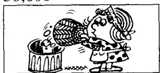
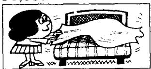
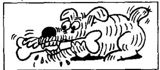
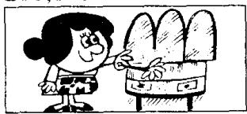
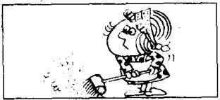
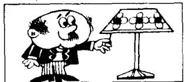

# Lesson 32 What's he/she/it doing? 他／她／它正在做什么？

Listen to the tape and answer the questions.

听录音并回答问题。

20,000

  
Nicola is typing  
30,000

  
She is emptying  
a basket.

  
a letter.  
Mr. Richards is opening  
the window.

  
My mother is making

  
the bed.  
Sally is shutting  
70,000  
the door.

  
It is eating  
a bone.  
80,000

  
My sister is looking  
at a picture.

  
Jack is reading  
a magazine.  
100,000

  
He is cleaning  
his teeth.  
200,000

  
She is dusting  
the dressing table.

  
Emma is cooking  
400,000

  
a meal.  
The cat is drinking  
its milk.

  
Amy is sweeping the floor.

  
Tim is sharpening a pencil.  
700,000

  
He is turning on the light.

  
The girl is turning  
off the tap.  
900,000

  
The boy is putting  
on his shirt.  
1,000,000

  
Mrs. Jones is taking  
off her coat.

## New words and expressions 生词和短语

type /taɪp/ v. 打字

tooth /tuːθ/ (复数 teeth /tiːθ/) n. 牙齿

letter /'letə/ n. 信

cook /kʊk/ v. 做（饭菜）

basket /'ba:skɪt/ n. 簋子

eat /iːt/ v. 吃

milk /milk/ n. 牛奶

bone /bəʊn/ n. 骨头

meal /miːl/ n. 饭，一顿饭

clean /kliːn/ v. 清洗

drink /drɪŋk/ v. 喝

tap /tæp/ n. （水）龙头

## Written exercises 书面练习

A Complete these sentences.

模仿例句把祈使句改写成现在进行时。

Example:

Sweep the floor! She is sweeping it.

1 Open the window! He \_\_\_\_.

2 Sharpen this pencil! She \_\_\_\_ .

3 Dust the cupboard! She \_\_\_\_.

4 Empty the basket! She \_\_\_\_.

5 Look at the picture! He \_\_\_\_.

B Write questions and answers.

模仿例句提问并回答。

## Example:

Nicola/emptying the basket/typing a letter

What is Nicola doing?

Is she emptying the basket?

No, she isn't emptying the basket.

She's typing a letter.

1 Mr. Richards/cleaning his teeth/opening the window

2 My mother/shutting the door/making the bed

3 The dog/drinking its milk/eating a bone

4 My sister/reading a magazine/looking at a picture

5 Emma/dusting the dressing table/cooking a meal

6 Amy/making the bed/sweeping the floor

7 Tim/reading a magazine/sharpening a pencil

8 The girl/turning on the light/turning off the tap

9 The boy/cleaning his teeth/putting on his shirt

10 Miss Jones/putting on her coat/taking off her coat
