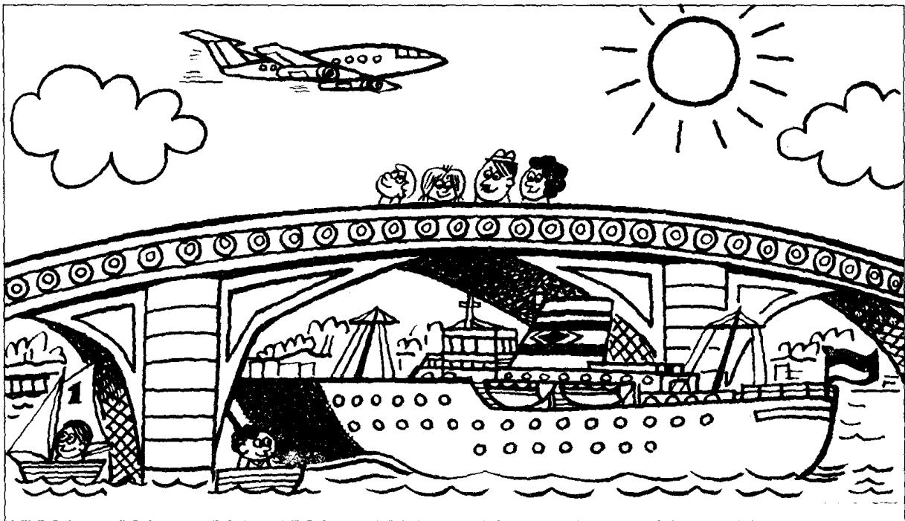

## Lesson 33 A fine day 晴天

Listen to the tape then answer this question. Where is the Jones family? 听录音，然后回答问题。琼斯一家人在哪里？

It is a fine day today.

There are some clouds in the sky,

but the sun is shining.

Mr. Jones is with his family.

They are walking over the bridge.

There are some boats on the river.

Mr. Jones and his wife are looking at them.

Sally is looking at a big ship.

The ship is going under the bridge.

Tim is looking at an aeroplane.

The aeroplane is flying over the river.

## New words and expressions 生词和短语

day /deɪ/ n. 日子

over /'əʊvə/ prep. 跨越，在……之上

cloud /klaʊd/ n. 云

bridge /bridʒ/ n. 桥

sky /skai/ n. 天空

sun /sʌn/ n. 太阳

boat /bəʊt/ n. 船

shine /ʃaɪn/ v. 照耀

river /'rɪvə/ n. 河

with /wɪð/ prep. 和……在一起

ship /ʃɪp/ n. 轮船

aeroplane /'eərəpleɪn/ n. 飞机

family /'fæmli/ n. 家庭（成员）

fly /flaɪ/ v. 飞

walk /wɔːk/ v. 走路，步行

## Notes on the text 课文注释

1. It is a fine day today.

句中的 it 是指天气。

2 some clouds, 几朵云。

some 可以修饰可数名词，也能修饰不可数名词。

## 参考译文

今天天气好。

天空中飘着几朵云，但阳光灿烂。

琼斯先生同他的家人在一起。

他们正在过桥。

河上有几艘船。

琼斯先生和他的妻子正在看这些船。

莎莉正在观看一艘大船。

那船正从桥下驶过。

蒂姆正望着一架飞机。

飞机正从河上飞过。
