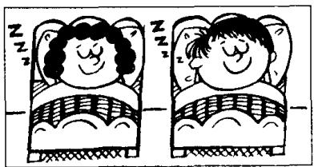
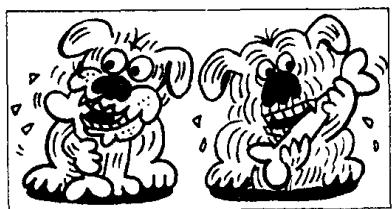
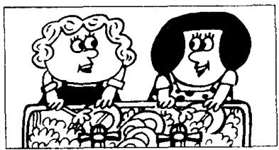

## Lesson 34 What are they doing? 他们在做什么？

Listen to the tape and answer the questions.

听录音并回答问题。

220,231

  
cooking  
331,342

  
sleeping  
442,453

  
shaving  
553,564

  
crying  
664,675

  
eating  
775,786

  
typing  
886,897

  
doing  
997,998

  
washing  
1,000,001

  
flying  
1,100,000  
walking

  
1,500,000

  
waiting  
2,000,000

  
jumping

## New words and expressions 生词和短语

sleep /sliːp/ v. 睡觉

wash /wɒʃ/ v. 洗

shave /ʃeɪv/ v. 刮脸

cry /kraɪ/ v. 哭，喊

wait /weit/ v. 等

jump /dʒʌmp/ v. 跳

## Written exercises 书面练习

A Complete these sentences.

模仿例句用现在进行时完成以下句子。

Example:

take — taking

Take . . . He is taking his book.

注意以下例句：

如果动词是以 -e 结尾，变成现在分词时要去掉 -e，然后再加 -ing。

1 Type . . . She is \_\_\_\_ a letter.

2 Make... She is \_\_\_\_ the bed.

3 Come... He is \_\_\_\_.

4 Shine . . . The sun is \_\_\_\_.

5 Give ... He is \_\_\_\_ me some magazines.

## B Write questions and answers.

模仿例句提问并回答。

## Example:

the children/looking at the boats on the river

What are the children doing?

They're looking at the boats on the river.

1 the men/cooking a meal

7 the children/doing their homework

2 they/sleeping

8 the women/washing dishes

3 the men/shaving

9 the birds/flying over the river

4 the children/crying

10 they/walking over the bridge

5 the dogs/eating bones

11 the man and the woman/waiting for a bus

6 the women/typing letters

12 the children/jumping off the wall

The park is on the right.
