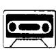
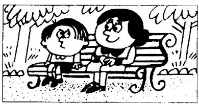
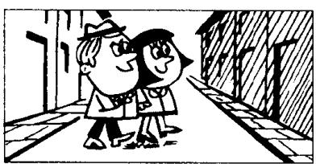
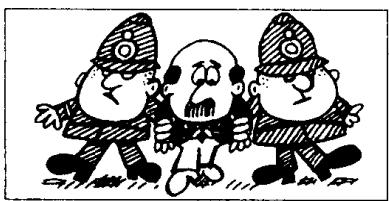
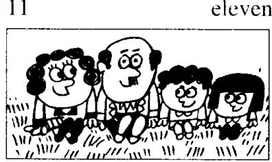

## Lesson 36 Where...? ……在哪里？

Listen to the tape and answer the questions.
听录音并回答问题。

1  
  
going into  
one

2  
  
two  
going out of

3  
three  
  
sitting beside

4  
  
walking across

5  
  
running along  
five

6  
  
jumping off

7  
  
walking between

8  
  
sitting near

9  
  
flying under

10  
  
flying over

ten  
11  
  
sitting on  
eleven

12  
  
reading in

## New words and expressions 生词和短语

beside /bɪˈsaɪd/ prep. 在……旁

off /ɒf/ prep. 离开

## Written exercises 书面练习

A Complete these sentences.

模仿例句用现在进行时完成以下句子。

注意：如果单音节动词仅有一个元音字母而其后跟一个辅音字母时，变成现在分词时要将此辅音字母双写。

## Example:

put — putting

put . . . He is putting on his coat.

1 swim... He is \_\_\_\_ across the river.

2 sit... She is \_\_\_\_ on the grass.

3 run ... The cat is \_\_\_\_ along the wall.

B Write sentences using these words.
模仿例句提问并回答。

## Examples:

boy swimming/across the river

Where is the boy swimming? He's swimming across the river.

children going/into the park

Where are the children going? They're going into the park.

1 man going/into the shop

2 woman going/out of the shop

7 man standing/between two policemen

3 he sitting/beside his mother

8 she sitting/near the tree

4 they walking/across the street

9 it flying/under the bridge

5 the cats running/along the wall

6 the children jumping/off the branch

10 the aeroplane flying/over the bridge

11 they sitting/on the grass

12 the man and the woman reading/in the living room
