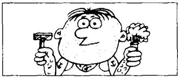
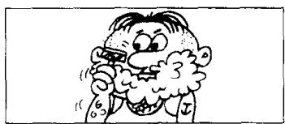
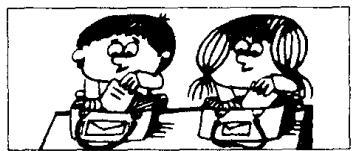
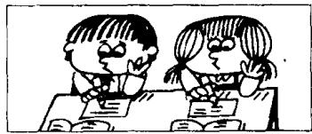
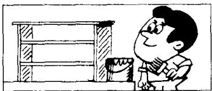

# Lesson 38 What are you going to do? 你准备做什么？What are you doing now? 你现在正在做什么？

Listen to the tape and answer the questions.

听录音并回答问题。

one

  
I am going to shave.

two

  
Now I am shaving.

three

  
I'm going to wait for a bus.  
four

  
Now I'm waiting for a bus.

five

  
We're going to do our homework.

six

  
Now we're doing our homework.

seven

  
I'm going to paint this bookcase.

eight

  
Now I'm painting this bookcase.

nine

  
We're going to listen to the stereo.

ten

  
Now we're listening to the stereo.

eleven

  
I'm going to wash the dishes.

twelve

  
Now I'm washing the dishes.

## New words and expressions 生词和短语

homework /'həʊmwɜːk/ n. 作业

dish /dɪʃ/ n. 盘子, 碟子

listen /'lɪsən/ v. 听

## Written exercises 书面练习

A Complete these sentences using am, is or are.

完成以下句子，用 am, is 或 are 填空。

Examples:

What \_\_\_\_ you doing?

What are you doing?

We \_\_\_\_ reading.

We are reading.

1 What \_\_\_\_ you doing? We \_\_\_\_ reading.

2 What \_\_\_\_ they doing? They \_\_\_\_ doing their homework.

3 What \_\_\_\_ he doing? He \_\_\_\_ working hard.

4 What \_\_\_\_ you doing? I \_\_\_\_ washing the dishes.

B Write questions and answers.

模仿例句写出相应的对话。

## Example:

paint this bookcase

What are you going to do?

I'm going to paint this bookcase.

What are you doing now?

I'm painting this bookcase.

I shave

2 wait for a bus

3 do my homework

4 listen to the stereo

5 wash the dishes
