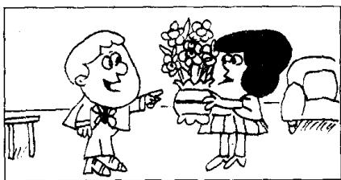
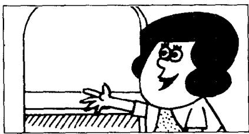
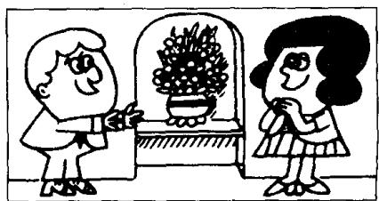

## Lesson 39 Don't drop it! 别摔了!

Listen to the tape then answer this question. Where does Sam put the vase in the end?

听录音，然后回答问题。萨姆把花瓶放在什么地方？

SAM : What are you going to do with that vase, Penny?

PENNY: I'm going to put it on this table, Sam.

SAM: Don't do that. Give it to me.

PENNY : What are you going to do with it?

SAM: I'm going to put it here, in front of the window.

PENNY: Be careful!
Don't drop it!

PENNY : Don't put it there, Sam.
Put it here,
on this shelf.

SAM: There we are!
It's a lovely vase.
PENNY: Those flowers are lovely, too.

## New words and expressions 生词和短语

front /frʌnt/ n. 前面 vase /vɑːz/ n. 花瓶

in front of 在……之前 drop /drop/ v. 掉下

careful /'keəfəl/ adj. 小心的，仔细的 flower /'flaʊə/ n. 花

## Notes on the text 课文注释

1 do with 指对某件事物或人的处理。

2 在第 29 课中，我们讲到在英文中需用祈使语气来表示直接的命令、建议等多种意图。而祈使句的否定形式则由 don't 加上动词原形组成，如课文中的 “Don't do that”; “Don't drop it” 等句子。

3 在第 21 课有这样的句型 “give me a book”，在本课文中又出现了 “give it to me” 的句型。在动词 give 后面可以有两个宾语：直接宾语（指物，如 a book, it）和间接宾语（指人，如 me）。如果直接宾语置于动词 give 之后，间接宾语则变成有 to 的介词短语。

4 Be careful! 小心点！这个固定结构常用来提醒他人可能发生的事故或困难。

5 There we are. 就放在那里。参见第 11 课课文注释 3。

## 参考译文

萨姆：你打算如何处理那花瓶？

彭妮：我打算把它放在这张桌子上，萨姆。

萨姆：不要放在那儿，把它给我。

彭妮：你打算怎么办？

萨姆：我准备把它放在这儿，放在窗前。

彭妮：小心点！别摔了！

彭妮：别放在那儿，萨姆。放在这儿，这个架子上。

萨姆：这是只漂亮的花瓶。

彭妮：那些花也很漂亮啊。

13 thirteen

18

15 fifteen
