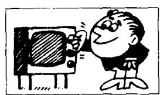
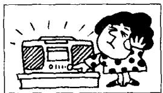
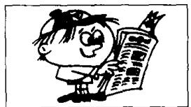
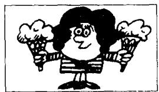

# Lesson 40 What are you going to do? 你准备做什么？I'm going to... 我准备……

Listen to the tape and answer the questions.

听录音并回答问题。

  
put it . . . !  
14 fourteen

  
take it...!

  
turn it . . . !  
16

sixteen

  
turn it . . . !

## What are you going to do with that/those ...? 你准备把那个／那些……？

I'm going to give/show/send/take... 我准备给/展示/送/拿

17

seventeen

  
to my daughter

  
to my grandmother  
nineteen

19

  
to my father  
20  
twenty

  
to my mother  
30  
to the children

  
40

  
to my wife

  
to my grandfather  
60  
sixty

  
to my sister

## New words and expressions 生词和短语

show /ʃəʊ/ v. 给……看
send /send/ v. 送给

take /teɪk/ v. 带给

## Written exercises 书面练习

A Rewrite these sentences.
模仿例句改写以下句子。

## Example:

Give me that vase.
Give that vase to me.

1 Send George that letter.  
2 Take her those flowers.  
3 Show me that picture.  
4 Give Mrs. Jones these books.  
5 Give the children these ice creams.

B Rewrite these sentences.
模仿例句改写以下句子。

## Examples:

Put on your coat!
I'm going to put it on.
Put on your shoes!
I'm going to put them on.

I Put on your hat!

2 Take off your shoes!

6 Take off your hat!

3 Turn on the taps!

7 Turn on the lights!

8 Turn off the television!

4 Turn off the light!

5 Put on your suit!

9 Turn off the lights!

10 Turn on the stereo!
