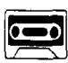
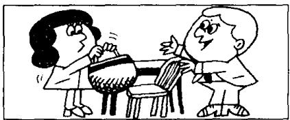
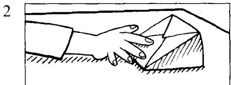
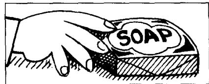
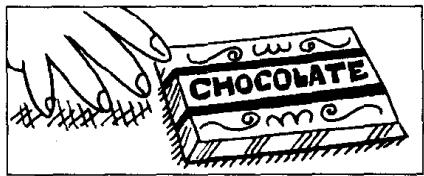
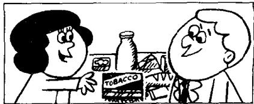

## Lesson 41 Penny's bag 彭妮的提包

Listen to the tape then answer this question. Who is the tin of tobacco for? 听录音，然后回答问题。那听烟丝是给谁买的？

SAM: Is that bag heavy, Penny?

PENNY : Not very.

SAM: Here! Put it on this chair. What's in it?

PENNY: A piece of cheese.

A loaf of bread.

A bar of soap.

A bar of chocolate.

A bottle of milk.

A pound of sugar.

Half a pound of coffee.

A quarter of a pound of tea.

And a tin of tobacco.

SAM: Is that tin of tobacco for me?

PENNY : Well, it's certainly not for me!

## New words and expressions 生词和短语

cheese /tʃiːz/ n. 乳酪，干酪

sugar /'ʃʊɡə/ n. 糖

bread /bred/ n. 面包

coffee /'kɒfi/ n. 咖啡

soap /səʊp/ n. 肥皂

tea /tiː/ n. 茶

chocolate /'tʃɒklɪt/ n. 巧克力

tobacco /tə'bækəʊ/ n. 烟草，烟丝

## Notes on the text 课文注释

1 Not very. 是 “It is not very heavy.” 的省略形式，常用于口语中。

2 a piece of, 一块，一张．一片，用在不可数名词前，表示数量，又如：a piece of bread, 一片面包。本课表示数量的短语还有：

a loaf of, 一个:

a bar of, 一条;

a bottle of, 一瓶;

a pound of, 一磅;

half a pound of, 半磅;

a quarter of, 四分之一 ( $\frac{1}{4}$ );

a tin of, 一听。

## 参考译文

萨姆：那个提包重吗，彭妮？

彭妮：不太重。

萨姆：放这儿。把它放在这把椅子上。里面是什么东西？

彭妮：一块乳酪、一个面包、一块肥皂、一块巧克力、一瓶牛奶、一磅糖、半磅咖啡、 $\frac{1}{4}$ 磅茶叶和一听烟丝。

萨姆：那听烟丝是给我的吗？

彭妮：噢，当然不会是给我的！
