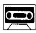
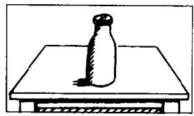
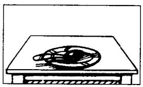
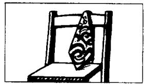
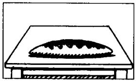
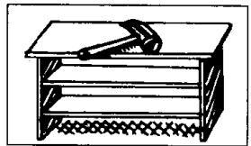
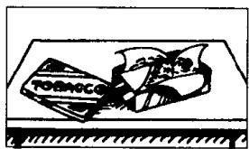

## Lesson 42 Is there a . . . in/on that . . .?
在那个……中／上有一个……吗？
Is there any . . . in/on that . . .?
在那个……中／上有……吗？

Listen to the tape and answer the questions.
听录音并回答问题。

thirteen

  
passport  
fourteen

  
milk  
fifteen

  
spoon  
sixteen

  
tie  
seventeen

  
bread  
eighteen

  
hammer  
nineteen

  
tea  
twenty

  
vase  
thirty  
suit

  
forty

  
tobacco  
fifty

  
chocolate  
sixty

  
cheese  
70  
seventy

  
newspaper  
80  
eighty  
car

  
90  
ninety

  
soap  
100  
a hundred

  
bird

## New words and expressions 生词和短语

bird /bɜːd/ n.

some /sʌm/ det. 一些

any /'eni/ det. 此

## Note on the text 课文注释

some 和 any 是英文中表示数量的限定词，它们一般不能精确地说明数量究竟有多大，在汉语中往往译为“一些”，some 一般用于肯定句中，any 一般用于不能确定答案是肯定还是否定的疑问句和含有 not 或 -n't 的否定句中。

## Written exercises 书面练习

A Complete these sentences using a, any or some.

完成以下句子，用 a, any 或 some 填空。

## Examples:

There's $a$ photograph on the desk.

Is there any milk in the bottle?

There isn't any milk in the bottle.

There's some milk in that cup.

1 Is there \_\_\_\_ bread in the kitchen?

2 There's \_\_\_\_ loaf on the table.

4 There isn't \_\_\_\_ chocolate on the table.

3 There's \_\_\_\_ coffee on the table, too.

5 There's \_\_\_\_ spoon on that dish.

6 Is there \_\_\_\_ soap on the dressing table?

B Write questions and answers using these words.

模仿例句提问并回答。

## Examples:

passport/on the table

Is there a passport here?

Yes, there is. There's one on the table.

bread/on the table

Is there any bread here? -

Yes, there is. There's some on the table.

1 spoon/on the plate

2 tie/on the chair

6 vase/on the radio

3 milk/on the table

7 suit/in the wardrobe

8 tobacco/in the tin

4 hammer/on the bookcase

5 tea/on the table

9 chocolate/on the desk

10 cheese/on the plate
