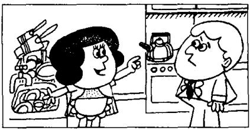
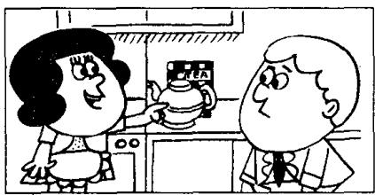

## Lesson 43 Hurry up! 快点!

Listen to the tape then answer this question.

How do you know Sam doesn't make the tea very often?

听录音，然后回答问题。你怎么知道萨姆不常沏茶？

PENNY : Can you make the tea, Sam?

SAM: Yes, of course I can, Penny.

SAM: Is there any water in this kettle?

PENNY : Yes, there is.

SAM: Where's the tea?

PENNY : It's over there, behind the teapot.

PENNY : Can you see it?

SAM: I can see the teapot, but I can't see the tea.

PENNY : There it is!
It's in front of you!

SAM: Ah yes, I can see it now.

SAM: Where are the cups?

PENNY : There are some in the cupboard.

PENNY : Can you find them?

SAM : Yes. Here they are.

PENNY : Hurry up, Sam!
The kettle's boiling!

## New words and expressions 生词和短语

of course /əv-'kɔ:s/ 当然

now /naʊ/ adv. 现在，此刻

kettle /'ketl/ n. 水壶

find /faɪnd/ v. 找到

behind /bɪˈhaɪnd/ prep. 在……后面

boil /'bɔɪl/ v. 沸腾，开

teapot /'tiːpɒt/ n. 茶壶

## Notes on the text 课文注释

1 make the tea, 沏茶。

2 over there 是指 “在那边”，指比较远的地方。

3 在 There are some in the cupboard 中, some 是代词, 指 some cups。

4 hurry up. 赶快，在祈使语气中用来催促他人。

## 参考译文

彭妮：你会沏茶吗，萨姆？

萨姆：会的，我当然会，彭妮。

萨姆：这水壶里有水吗？

彭妮：有水。

萨姆：茶叶在哪儿？

彭妮：就在那儿，茶壶后面。

彭妮：你看见了吗？

萨姆：茶壶我看见了，但茶叶没看到。

彭妮：那不是么！就在你眼前。

萨姆：噢，是啊，我现在看到了。

萨姆：茶杯在哪儿呢？

彭妮：碗橱里有几只。

彭妮：你找得到吗？

萨姆：找得到。就在这儿呢。

彭妮：快，萨姆。水开了！
