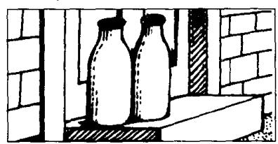
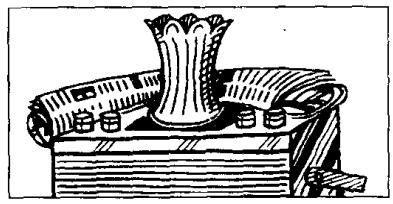
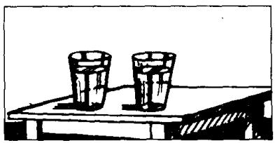
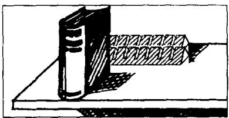
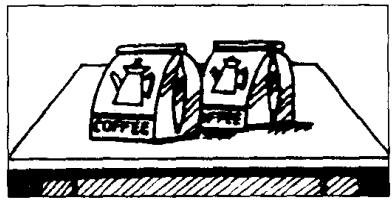

# Lesson 44 Are there any ...? 有些……吗? Is there any ...? 有些……吗?

Listen to the tape and answer the questions.
听录音并回答问题。

seventy

  
bread on the table  
eighty

  
hammers behind that box  
ninety

  
milk in front of the door

## a hundred

  
soap on the cupboard  
two hundred

  
newspapers behind that vase  
three hundred

  
water in those glasses  
four hundred

  
tea in those cups  
five hundred

  
cups in front of that kettle  
six hundred

  
chocolate behind that book  
seven hundred

  
teapots in the cupboard  
eight hundred

  
cars in front of that building  
nine hundred

  
coffee on the table

## Written exercises 书面练习

A Look at these:

注意名词的单数和复数形式：

glass -- glasses; book -- books; housewife -- housewives.

Rewrite these sentences.

改写以下句子，用名词的复数形式填空。

## Example:

I can see some cups. But I can't see any \_\_\_\_ \_\_\_\_ (glass).

I can see some cups, but I can't see any glasses.

I can see some spoons, but I can't see any \_\_\_\_ (knife).

2 I can see some hammers, but I can't see any \_\_\_\_ (box).

3 I can see some coffee, but I can't see any \_\_\_\_ (loaf) of bread.

4 I can see some cupboards, but I can't see any \_\_\_\_ (shelf).

5 I can see Mr. Jones and Mr. Brown, but I can't see their \_\_\_\_ (wife).

6 I can see some cups, but I can't see any \_ (dish).

7 I can see some cars, but I can't see any \_\_\_\_ (bus).

B Write questions and answers using these words.

模仿例句提问并回答。

## Examples:

bread/on the table

Is there any bread here?

Yes, there is. There's some on the table.

hammers/behind that box

Are there any hammers here?

Yes, there are. There are some on the table.

1 milk/in front of the door

6 cups/in front of that kettle

2 soap/on the cupboard

7 chocolate/behind that book

3 newspapers/behind that vase

8 teapots/in that cupboard

4 water/in those glasses

9 cars/in front of that building

5 tea/in those cups

10 coffee/on the table
