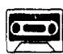
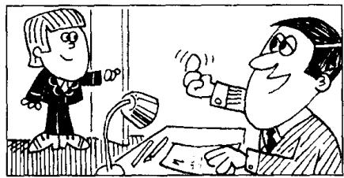
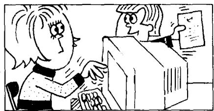
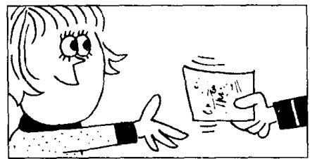
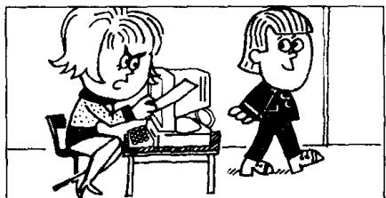
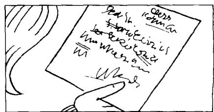

## Lesson 45 The boss's letter 老板的信

Listen to the tape then answer this question.

Why can't Pamela type the letter?

听录音，然后回答问题。帕梅拉为什么无法打信？

THE BOSS : Can you come here a minute please, Bob?

BOB : Yes, sir?

THE BOSS: Where's Pamela?

BOB : She's next door.  
She's in her office, sir.

THE BOSS : Can she type
this letter for me?
Ask her please.

BOB: Yes, sir.

BOB : Can you type this letter for the boss please, Pamela?

PAMELA : Yes, of course I can.

BOB : Here you are.

PAMELA : Thank you, Bob.

PAMELA : Bob!

BOB: Yes? What's the matter?

PAMELA: I can't type this letter.

PAMELA: I can't read it! The boss's handwriting is terrible!

## New words and expressions 生词和短语

can /kæn/ modal verb 能够

ask /ɑːsk/ v. 请求，要求

boss /bɒs/ n. 老板，上司

minute /'mɪnɪt/ n. 分 (钟)

handwriting /'hændˌraɪtɪŋ/ n. 书写

terrible /'teribəl/ adj. 糟糕的，可怕的

## Notes on the text 课文注释

1 Can you come here a minute please, Bob?

句中的 can 是情态动词，表示 “能力”。情态动词的否定式由情态动词加 not 构成；疑问句中将情态动词置于句首，后接句子的主语和主要谓语动词。

句中 a minute 作时间状语，当 “一会儿” 讲。

2 next door. 隔壁。

3 boss's, 老板的。这种所有格的形式已在第 11 课的课文注释中讲过。请注意它的发音是 /'bɒsɪs/。

## 参考译文

老板：请你来一下好吗，鲍勃？

鲍勃：什么事，先生？

老板：帕梅拉在哪儿？

鲍勃：她在隔壁，在她的办公室里，先生。

老板：她能为我打一下这封信吗？请问问她。

鲍勃：好的，先生。

鲍勃：请你把这封信给老板打一下可以吗，帕梅拉？

帕梅拉：可以，当然可以。

鲍勃：给你这信。

帕梅拉：谢谢你，鲍勃。

帕梅拉：鲍勃！

鲍勃：怎么了？怎么回事？

帕梅拉：我打不了这封信。

帕梅拉：我看不懂这封信，老板的书写太糟糕了！

I can lift that chair,
but I can't lift this table.
