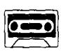
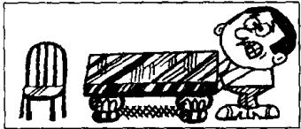
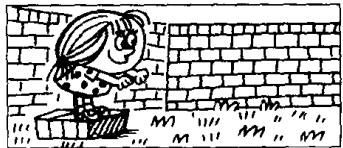
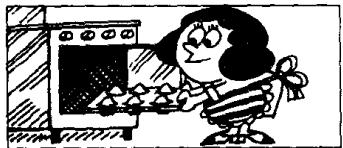

## Lesson 46 Can you ...? 你能……吗？

Listen to the tape and answer the questions.
听录音，然后回答这个问题。

1,000

a thousand

  
I can put my hat on,  
but I can't put my coat on.  
5,000  
five thousand

  
I can see that aeroplane,  
but I can't see a bird.

10,000

ten thousand

  
I can paint this bookcase,  
but I can't paint this room.

100,000

a hundred thousand

210,000

two hundred and ten thousand

  
I can read this book, but I can't read that magazine.

350,000

three hundred and fifty thousand

  
I can jump off this box;  
but I can't jump off that wall.

500,000

five hundred thousand

  
I can make cakes,  
but I can't make biscuits.

1,000,000
a million

  
I can put the vase on this table,  
but I can't put it on that shelf.

## New words and expressions 生词和短语

lift /lɪft/ v. 拿起、搬起、举起

biscuit /'bɪskɪt/ n. 饼干

cake /keɪk/ n. 饼、蛋糕

## Written exercises 书面练习

A Rewrite these sentences.

模仿例句改写以下句子。

## Examples :

He is taking his book. He can take his book.

She is putting on her coat. She can put on her coat.

1 They are typing these letters.

2 She is making the bed.

5 We are running across the park.

6 He is sitting on the grass.

3 You are swimming across the river.

7 I am giving him some chocolate.

4 We are coming now.

B Write questions and answers using I, he, she, it, we or they.

模仿例句写出相应的对话，选用 l, he, she, it, we 或 they 等代词。

## Examples :

Can you put on your coat?

Yes, I can.

What can you do?

I can put on my coat.

Can you and Sam listen to the radio?

Yes, we can.

What can you and Sam do?

We can listen to the radio.

1 Can you type this letter?

5 Can the cat drink its milk?

2 Can Penny wait for the bus?

6 Can you and Sam paint this bookcase?

3 Can Penny and Jane wash the dishes?

7 Can you see that aeroplane?

4 Can George take these flowers to her?

8 Can Jane read this book?
