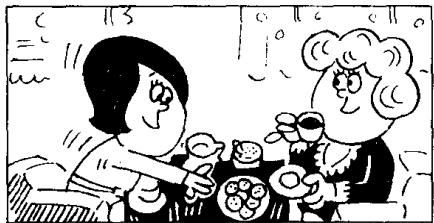

## Lesson 47 A cup of coffee 一杯咖啡

Listen to the tape then answer this question. How does Ann like her coffee? 听录音，然后回答问题。安想要什么样的咖啡？

CHRISTINE : Do you like coffee, Ann?
ANN : Yes, I do.

CHRISTINE : Do you want a cup?

ANN : Yes, please, Christine.

CHRISTINE : Do you want any sugar?

ANN: Yes, please.

CHRISTINE : Do you want any milk?

ANN: No, thank you. I don't like milk in my coffee. I like black coffee.

CHRISTINE : Do you like biscuits?

ANN: Yes, I do.

CHRISTINE : Do you want one?

ANN: Yes, please.

## New words and expressions 生词和短语

like /laɪk/ v. 喜欢，想要 want /wɒnt/ v. 想

## Notes on the text 课文注释

1 Do you want a cup?

句中的 a cup 后面省略了 of coffee。英语中的动词主要有及物动词和不及物动词两大类，及物动词的后面要有名词或名词性短语做宾语。like 和 want 都是及物动词。

2 Yes, I do.

是一种简略回答。完整的回答是: Yes, I like coffee. 句中的 do 是助动词，用来替代动词，常用于简略答语中。

3 black coffee 是指不加牛奶或咖啡伴侣的咖啡，加牛奶的咖啡叫 white coffee。

4 Do you want one?

句中不定代词 one 是指 biscuit, 以免重复。

## 参考译文

克里斯廷：你喜欢咖啡吗，安？

安：是的，我喜欢。

克里斯廷：你想要一杯吗？

安：好的，请来一杯，克里斯廷。

克里斯廷：你要放些糖吗？

安：好的，请放一些。

克里斯廷：要放些牛奶吗？

安：不了，谢谢。我不喜欢咖啡中放牛奶，我喜欢清咖啡。

克里斯廷：你喜欢饼干吗？

安：是的，我喜欢。

克里斯廷：你想要一块吗？

安：好的，请来一块。
