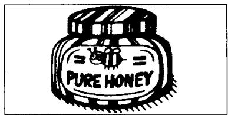
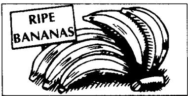
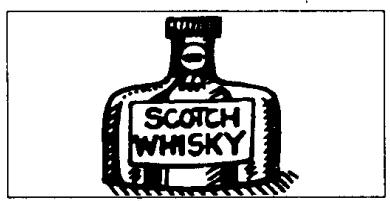
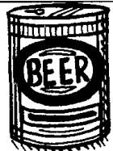

# Lesson 48 Do you like . . .? 你喜欢……吗？ Do you want . . .? 你想要……吗？

Listen to the tape and answer the questions.

听录音并回答问题。

1st

  
first  
2nd

  
second  
3rd  
third

  
4th

  
fourth  
5th

  
fifth  
6th

  
sixth  
7th

  
seventh  
8th

  
eighth  
9th  
ninth

  
10th

  
tenth  
11th  
eleventh

  
12th  
twelfth

## New words and expressions 生词和短语

fresh /freʃ/ adj. 新鲜的

sweet /swiːt/ adj. 甜的

egg /eq/ n. 鸡蛋

orange /'prɪndʒ/ n. 橙

butter /'bʌtə/ n. 黄油

Scotch whisky /'skɒtʃ- 'wɪski/ 苏格兰威士忌

pure /pjoə/ adj. 纯净的

choice /tʃɔɪs/ adj. 上等的，精选的

honey /'hʌni/ n. 蜂蜜

apple /'æpl/ n. 苹果

ripe /raɪp/ adj. 成熟的

banana /bəˈnɑːnə/ n. 香蕉

wine /wain/ n. 酒，果酒

jam /dʒæm/ n. 果酱

beer /bɪə/ n. 啤酒

blackboard /'blækbo:d/ n. 黑板

## Written exercises 书面练习

A Complete these sentences using off, over, between, along, in front of, behind, under or across.

完成以下句子，用 off, over, between, along, in front of, behind, under 或 across 等介词或介词短语填空。

1 The aeroplane is flying \_\_\_\_ the village.

2 The ship is going \_\_\_\_ the bridge.

3 The children are swimming \_\_\_\_ the river.

4 Two cats are running \_\_\_\_ the wall.

5 The boy is jumping \_\_\_\_ the branch.

6 The girl is sitting \_\_\_\_ her mother and her father.

7 The teacher is standing \_\_\_\_ the blackboard.

8 The blackboard is \_\_\_\_ the teacher.

## B Answer these questions.

模仿例句回答问题，注意可数名词与不可数名词的区别。

Examples :

Do you like eggs?

Yes, I do.

Do you like butter?

I like eggs, but I don't want one.

Yes, I do.

I like butter, but I don't want any.

1 Do you like honey?

6 Do you like whisky?

2 Do you like bananas?

7 Do you like apples?

3 Do you like jam?

8 Do you like wine?

4 Do you like oranges?

9 Do you like biscuits?

5 Do you like ice cream?

10 Do you like beer?
