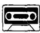
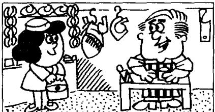

## Lesson 49 At the butcher's 在肉店

Listen to the tape then answer this question. What does Mr. Bird like? 听录音，然后回答问题。伯德先生喜欢什么？

BUTCHER : Do you want any meat today, Mrs. Bird?

MRS. BIRD : Yes, please.

BUTCHER : Do you want beef or lamb?

MRS. BIRD : Beef, please.

BUTCHER: This lamb's very good.

MRS. BIRD: I like lamb,
but my husband doesn't.

BUTCHER : What about some steak?
This is a nice piece.

MRS. BIRD : Give me that piece, please.

MRS. BIRD : And a pound of mince, too.

BUTCHER : Do you want a chicken, Mrs. Bird?
They're very nice.

MRS. BIRD : No, thank you.

MRS. BIRD: My husband likes steak, but he doesn't like chicken.

BUTCHER: To tell you the truth, Mrs. Bird, I don't like chicken either!

## New words and expressions 生词和短语

butcher /'botʃə/ n. 买肉的

mince /mɪns/ n. 肉馅，绞肉

meat /miːt/ n. （食用）肉

chicken /'tʃɪkən/ n. 鸡

beef /biːf/ n. 牛肉

tell /tel/ v. 告诉

lamb /læm/ n. 羔羊肉

truth /truːθ/ n. 实情

husband /'hʌzbənd/ n. 丈夫

either /'aɪðə/ adv. 也（用于否定句）

steak /steɪk/ n. 牛排

## Notes on the text 课文注释

1 Do you want beef or lamb?

是选择疑问句，本句有两项选择，第一选择 beef 念升调，lamb 则读降调。

2 I like lamb, but my husband doesn't.

句中的 doesn't 后面省略了 like lamb。用 but 连接的并列句，在后一分句中可以省略与前一分句中相同的谓语动词和宾语。

3 To tell you the truth （或 To tell the truth），意思是：“老实说”，“说实话”。

4 I don't like chicken either.

either 当 “也（不）” 讲，用在否定句中。肯定句和疑问句中可用 too，在第 7 课和第 31 课中已出现这样的句子。

## 参考译文

肉商：您今天要买点肉吗，伯德夫人？

伯德夫人：是的，我买一点。

肉商：您要牛肉还是要羔羊肉？

伯德夫人：请给我牛肉。

肉 商：这羔羊肉很好。

伯德夫人：我喜欢羔羊肉，可我丈夫不喜欢。

肉商：来点牛排吗？这块很好。

伯德夫人：就请给我那块吧。

伯德夫人：再来一磅绞肉。

肉商：您要买只鸡吗，伯德夫人？这些鸡很好。

伯德夫人：不要了，谢谢。

伯德夫人：我丈夫喜欢牛排，但他不喜欢鸡。

肉商：说老实话，伯德夫人，我也不喜欢鸡。
