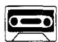
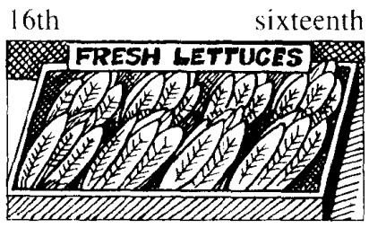
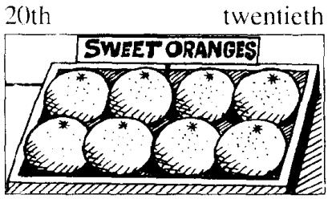
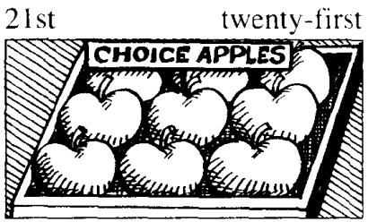
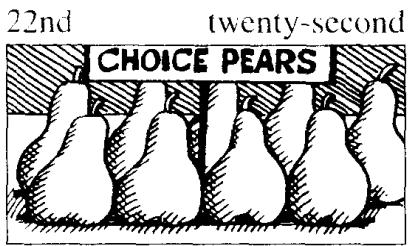

## Lesson 50 He likes... 他喜欢……

# But he doesn't like ... 但是他不喜欢……

Listen to the tape and answer the questions.

听录音并回答问题。

## New words and expressions 生词和短语

tomato /təˈmɑːtəʊ/ n. 西红柿

bean /biːn/ n. 豆角

potato /pə'teɪtəʊ/ n. 土豆

pear /peə/ n. 梨

cabbage /'kæbɪdʒ/ n. 卷心菜

lettuce /'letɪs/ n. 莴苣

grape /greɪp/ n. 葡萄

pea /piː/ n. 豌豆

peach /piːtʃ/ n. 桃

## Written exercises 书面练习

A Complete these sentences using am not, aren't, isn't, can't, don't or doesn't.
完成以下句子，用 am not, aren't, isn't, can't, don't 或 doesn't 填空。

1 He likes coffee, but I \_\_\_\_.

2 She likes tea, but he \_\_\_\_.

3 He is eating some bread, but she \_\_\_\_.

4 She can type very well, but he \_\_\_\_.

5 They are working hard, but we \_\_\_\_.

6 He is reading a magazine, but I \_\_\_\_.

B Answer these questions using I, he or she.

模仿例句回答以下问题，选用 l, he 或 she。

## Examples :

Does Penny like tomatoes?

Yes, she does.

She likes tomatoes, but she doesn't want any.

Do you like potatoes?

Yes, I do.

I like potatoes, but I don't want any.

1 Does Sam like cabbage?

2 Does Sam like lettuce?

6 Does Mr. Jones like oranges?

3 Do you like peas?

7 Does George like apples?

8 Does Elizabeth like pears?

4 Does Mrs. White like beans?

5 Do you like bananas?

9 Do you like grapes?

10 Does Carol like peaches?
