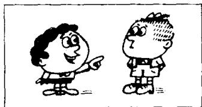
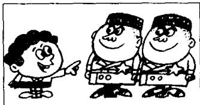
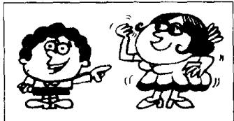

# Lesson 52 What nationality are they? 他们是哪国人？Where do they come from? 他们来自哪个国家？

Listen to the tape and answer the questions.
听录音并回答问题。

## 20th

  
I'm American.  
I come from the U.S.

## 21st

  
He's Brazilian.  
He comes from Brazil.

## 22nd

  
She's Dutch.  
She comes from Holland.

## 23rd

  
We're English.  
We come from England.

## 24th

  
They're French.  
They come from France.

## 25th

  
You're German.  
You come from Germany.

## 26th

  
He's Greek.  
He comes from Greece.  
27th

  
You're Italian.  
You come from Italy.

## 28th

  
We're Norwegian.
We come from Norway.  
29th

  
They're Russian.  
They come from Russia.

## 30th

  
She's Spanish.  
She comes from Spain.

## 31st

  
I'm Swedish.  
I come from Sweden.

## New words and expressions 生词和短语

the U.S. 美国

Italy /'ɪtəli/ n. 意大利

Brazil /brə'zɪl/ n. 巴西

Norway /'nɔːweɪ/ n. 挪威

Holland /'hɒlənd/ n. 荷兰

Russia /'rʌʃə/ n. 俄罗斯

England /'ɪŋglənd/ n. 英国

Spain /speɪn/ n. 西班牙

France /'fra:ns/ n. 法国

Sweden /'swi:dn/ n. 瑞典

Germany /'dʒɜːməni/ n. 德国

## Note on the text 课文注释

the U.S. 与 the U.S.A. 是 the United States of America 的缩写，用的是两或三个首字母，即美利坚合众国。

## Written exercises 书面练习

A Complete these sentences.

模仿例句完成以下句子。

## Example :

I come from England, but Stella \_\_\_\_ from Spain.

I come from England, but Stella comes from Spain.

1 We come from Germany, but Dimitri \_\_\_\_ from Greece.

2 I like cold weather, but he \_\_\_\_ warm weather.

3 He comes from the U.S., but she \_\_\_\_ from England.

4 She doesn't like the winter, but she \_\_\_\_ the summer.

5 I come from Norway, but you \_\_\_\_ from Spain.

6 Stella comes from Spain, but Hans and Karl \_\_\_\_ from Germany.

7 We don't come from Spain. We \_\_\_\_ from Brazil.

B Write questions and answers.

模仿例句提问并回答。

## Example :

he/(Brazil)/the U.S.

Where does he come from?

Does he come from Brazil?

No, he doesn't come from Brazil. He comes from the U.S.

What nationality is he?

He's American.

1 she/(England)/the U.S.

5 they/(Greece)/Italy

9 she/(Norway)/France

2 they/(France)/England

6 they/(Brazil)/Norway

10 he/(the U.S.)/Brazil

3 he/(France)/Germany

7 they/(Norway)/Greece

4 he/(Italy)/Greece

8 she/(Italy)/Spain
