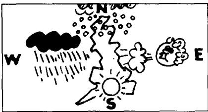
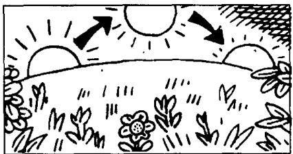

## Lesson 53 An interesting climate 有趣的气候

Listen to the tape then answer this question.

What is the favourite subject of conversation in England?

听录音，然后回答问题。在英国最受欢迎的话题是什么？

HANS : Where do you come from?

JIM : I come from England.

HANS: What's the climate like in your country?

JIM : It's mild,
but it's not always pleasant.

JIM: The weather's often cold in the North and windy in the East. It's often wet in the West and sometimes warm in the South.

HANS : Which seasons do you like best?

JIM : I like spring and summer.
The days are long
and the nights are short.
The sun rises early
and sets late.

JIM: I don't like autumn and winter. The days are short and the nights are long. The sun rises late and sets early. Our climate is not very good, but it's certainly interesting. It's our favourite subject of conversation.

## New words and expressions 生词和短语

mild /maɪld/ adj. 温和的，温暖的

night /nait/ n. 夜晚

always /'ɔːlweɪz/ adv. 总是

rise /raɪz/ v. 升起

north /nɔːθ/ n. 北方

early /'ɜːli/ adv. 早

east /iːst/ n. 东方

set /set/ v. （太阳）落下去

wet /wet/ adj. 潮湿的

west /west/ n. 西方

late /leɪt/ adv. 晚，迟

south /saʊθ/ n. 南方

interesting /'intristɪŋ/ adj. 有趣的，有意思的

season /'siːzən/ n. 季节

subject /'sʌbdʒɪkt/ n. 话题

best /best/ adv. 最

conversation /ˌkɒnvəˈseɪʃən/ n. 谈话

## Note on the text 课文注释

in the North = in the north of England

North 的第一个字母大写，是因为它单独使用，特指英国的北部。

## 参考译文

汉斯：你是哪国人？

吉姆：我是英国人。

汉斯：你们国家的气候怎么样？

吉姆：气候温和，但也不总是宜人的。

吉姆：北部的天气常常寒冷，东部则常常刮风。
西部常下雨，南部有时则很暖和。

汉斯：你最喜欢哪些季节？

吉姆：我最喜欢春季和夏季。因为此时白天长而夜晚短，太阳升得早而落得晚。

吉姆：我不喜欢秋季和冬季。因为此时白天短而夜晚长，太阳升得迟而落得早。
虽然我们国家的气候并不很好，但又确实很有意思。天气是我们最喜欢谈论的话题。
