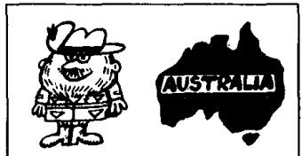
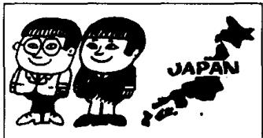
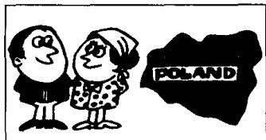

# Lesson 54 What nationality are they? 他们是哪国人？Where do they come from? 他们来自哪个国家？

Listen to the tape and answer the questions.

听录音并回答问题。

## 20th

  
I'm Australian.  
I come from Australia.

## 30th

  
He's Austrian.  
He comes from Austria.

## 40th

  
He's Canadian.  
He comes from Canada.

## 50th

  
We're Chinese.  
We come from China.

## 60th

  
You're Finnish.  
You come from Finland.

## 70th

  
She's Indian.  
She comes from India.

## 80th

  
You're Japanese.  
You come from Japan.

## 90th

  
I'm Korean.  
I come from Korea.

## 100th

  
We're Nigerian.  
We come from Nigeria.

## 101st

  
They're Polish.  
They come from Poland.

## 102nd

  
She is Thai.
She comes from Thailand.

## 103rd

  
She's Turkish.  
She comes from Turkey.

## New words and expressions 生词和短语

Australia /ɒs'treɪljə/ n. 澳大利亚

Japan /dʒəˈpæn/ n. 日本

Australian /ɒsˈtreɪljən/ n. 澳大利亚人

Nigeria /naɪˈdʒɪəriə/ n. 尼日利亚

Austria /'ɒstriə/ n. 奥地利

Nigerian /naɪˈdʒɪəriən/ n. 尼日利亚人

Austrian /'ɒstriən/ n. 奥地利人

Turkey /'tɜːki/ n. 土耳其

Canada /'kænədə/ n. 加拿大

Turkish /'tɜːkɪʃ/ n. 土耳其人

Canadian /kəˈneɪdiən/ n. 加拿大人

Korea /kəˈrɪə/ n. 韩国

China /'tʃaɪnə/ n. 中国

Finland /'fɪnlənd/ n. 芬兰

Polish /'pəʊlɪʃ/ n. 波兰人

Finnish /'fɪnɪʃ/ n. 芬兰人

Poland /'pəʊlənd/ n. 波兰

India /'ɪndiə/ n. 印度

Thai /taɪ/ n. 泰国人

Indian /'ɪndiən/ n. 印度人

Thailand /'taɪlənd/ n. 泰国

## Written exercises 书面练习

A Write questions and answers.

模仿例句写出与下列句子相对应的疑问句和否定句。

Example :

The sun rises early.

Does the sun rise early?

The sun doesn't rise early.

1 The sun sets late.

2 He likes ice cream.

3 Mrs. Jones wants a biscuit.

4 Jim comes from England.

B Write questions and answers using these words.

模仿例句提问并回答。

Example :

he/Brazil

Where does he come from? Is he Brazilian?

Yes. He's Brazilian. He comes from Brazil.

1 he/Australia

6 she/India

2 he/Austria

7 they/Japan

3 he/Canada

8 they/Nigeria

4 they/China

9 she/Turkey

5 he/Finland

10 she/Korea
