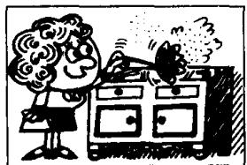
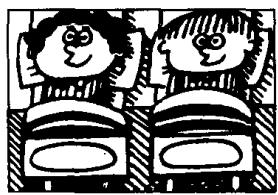
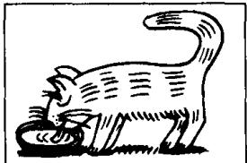

## Lesson 56 What do they usually do? 他们通常做什么？

Listen to the tape and answer the questions.

听录音并回答问题。

every day

in the morning

in the afternoon

at noon

at night

in the evening

1st

dusts

  
2nd

  
makes  
3rd

  
shaves  
4th

  
listen  
21st  
cleans

  
22nd

  
go  
23rd

  
washes  
24th

  
type  
31st  
drinks

  
32nd  
watch

  
33rd

  
eats  
34th

  
reads

## Written exercises 书面练习

A Complete these sentences using -s or -es.

完成以下句子，根据需要在动词后面加上-s或-es。

Example :

She wash \_\_\_\_ the dishes every day.

She washes the dishes every day.

1 The children go \_\_\_\_ to school in the morning.

2 Their father take \_\_\_\_ them to school.

3 Mrs. Sawyer stay \_\_\_\_ at home.

4 She do \_\_\_\_ the housework.

5 She always eat \_\_\_\_ her lunch at noon.

B Write questions and answers.

模仿例句提问并回答。

## Example :

she/morning often/dust/the cupboard

What does she do in the morning?

She often dusts the cupboard in the morning.

1 she/morning always/make/the bed

2 he/morning always/shave

3 they/evening sometimes/listen to/the stereo

4 he/every day always/clean/the blackboard

5 they/night always/go/to bed early

6 she/every day usually/wash/the dishes

7 they/afternoon usually/type/some letters

8 it/every day usually/drink/some milk

9 they/evening sometimes/watch/television

10 she/noon always/eat/her lunch

11 he/evening often/read/his newspaper
