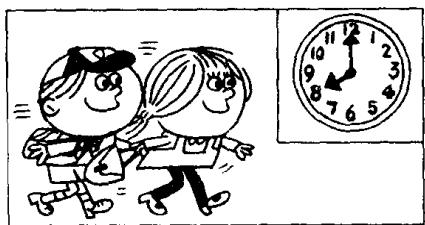
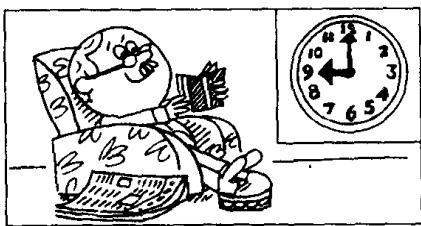

## Lesson 57 An unusual day 很不平常的一天

Listen to the tape then answer this question.

What is Mr. Sawyer doing tonight?

听录音，然后回答问题。索耶先生今晚正在做什么？

It is eight o'clock.
The children go to school by car
every day,
but today,
they are going to school on foot.

It is ten o'clock.  
Mrs. Sawyer usually stays at home in the morning,  
but this morning,  
she is going to the shops.

It is four o'clock.  
In the afternoon,  
Mrs. Sawyer usually drinks tea in the living room.  
But this afternoon,  
she is drinking tea in the garden.

It is six o'clock.  
In the evening,  
the children usually do their homework,  
but this evening,  
they are not doing their homework.  
At the moment,  
they are playing in the garden.

It is nine o'clock.  
Mr. Sawyer usually reads his newspaper at night.  
But he's not reading his newspaper tonight.  
At the moment,  
he's reading an interesting book.

o'clock /ə'klɒk/ adv. 点钟

moment /'məʊmənt/ n. 片刻，瞬间

shop /ʃɒp/ n. 商店

## Notes on the text 课文注释

1 It is eight o'clock. 现在是 8 点钟。在英语中常用 it 来指时间、天气、温度或距离。这种 it 被称作 “虚主语”。

2 by car, 乘汽车。on foot, 步行。这两个状语短语均用来表示方式。

3 at the moment, 指眼前，“此刻”。

## 参考译文

现在是8点钟。孩子们每天都乘小汽车去上学，而今天，他们正步行去上学。

现在是10点钟。上午，索耶夫人通常是呆在家里的，但今天上午，她正去商店买东西。

现在是4点钟。下午，索耶夫人通常是在客厅里喝茶，但今天下午，她正在花园里喝茶。

现在是6点钟。晚上，孩子们通常是做作业，而今天晚上，他们没做作业。此刻，他们正在花园里玩。

现在是9点钟。索耶先生通常是在晚上看报，但今天晚上他没看报。此刻，他正在看一本有趣的书。

13th

2nd

17th
