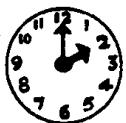
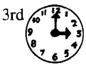
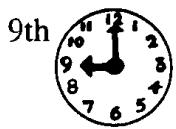
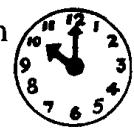
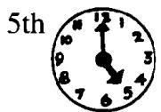
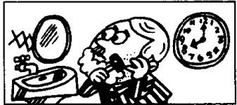
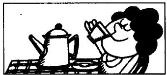
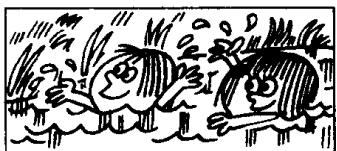
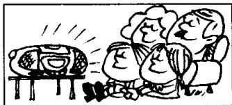

# Lesson 58 What's the time? 几点钟?

Listen to the tape and answer the questions.

听录音并回答问题。

1st

  
They usually . . . but today, they are . . . 他们总是……，但是今天他们正

  
He usually shaves at  
14th

  
but today, he . . .  
seven o'clock every day,

15th

  
She usually drinks tea in the morning,  
16th

  
but this morning, she . . .

  
They usually play in the  
18th

  
but this afternoon, they . . .  
garden in the afternoon,  
19th

  
I usually cook a meal in the evening,  
20th

  
but this evening, I . . .  
21st

  
We usually watch television at night,  
22nd

  
but tonight, we ...

## Written exercises 书面练习

A Complete these sentences.
模仿例句完成以下句子。

Example :

He usually shaves at 7.00 o'clock,

but today, he \_\_\_\_ at 8.00.

He usually shaves at 7.00 o'clock,

but today, he is shaving at 8.00.

1 She usually drinks tea in the morning, but this morning, she \_\_\_\_ coffee.

2 They usually play in the garden in the afternoon, but this afternoon, they \_\_\_\_ in the park.

3 He usually washes the dishes at night, but tonight he \_\_\_\_ clothes.

B Write questions and answers following the pattern in the example.

模仿例句提问并回答。

Examples :

they/every day go/to school by car

What do they usually do every day?

They usually go to school by car every day.

today go/to school on foot

What are they doing today?

They are going to school on foot today.

1 she/morning drink/tea

1 she/morning
morning

drink/coffee

2 they/afternoon
afternoon

play/in the garden

swim/in the river

3 I/evening
evening cook/a meal

4 we/night watch/television

read/a book

tonight listen to/the stereo
