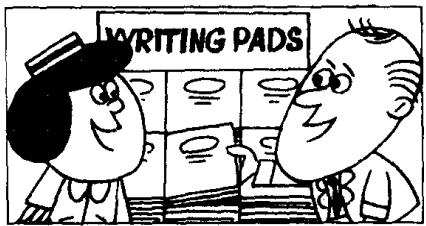
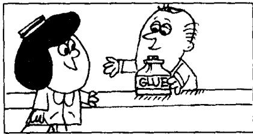
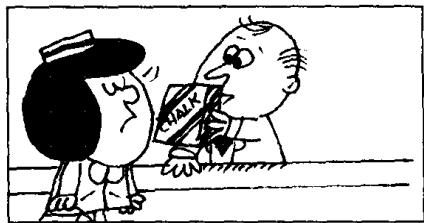
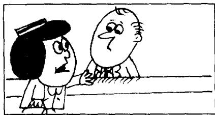

## Lesson 59 Is that all? 就这些吗？

Listen to the tape then answer this question. Does the lady buy any chalk? 听录音，然后回答问题。这位女士有没有买粉笔？

LADY : I want some envelopes, please.

SHOP ASSISTANT: Do you want the large size or the small size?

LADY : The large size, please.

LADY : Do you have any writing paper?

SHOP ASSISTANT: Yes, we do.

SHOP ASSISTANT: I don't have any small pads.  
I only have large ones.  
Do you want a pad?

LADY : Yes, please.

LADY : And I want some glue.

SHOP ASSISTANT: A bottle of glue.

LADY : And I want
a large box of chalk, too.

SHOP ASSISTANT : I only have small boxes.
Do you want one?

LADY : No, thank you.

SHOP ASSISTANT : Is that all?

LADY : That's all, thank you.

SHOP ASSISTANT : What else do you want?

LADY : I want my change.

## New words and expressions 生词和短语

envelope /'envələʊp/ n. 信封

pad /pæd/ n. 信笺簿

writing paper /'raɪtɪŋ- 'peɪpə/ 信纸

glue /gluː/ n. 胶水

shop assistant /'ʃɒp-ə'sɪstənt/ 售货员

chalk /tʃɔːk/ n. 粉笔

size /saiz/ n. 尺寸，尺码，大小

change /tʃeɪndʒ/ n. 零钱，找给的钱

## Notes on the text 课文注释

1 Do you want the large size or the small size?

这句话是选择疑问句，逗号前的 size 读升调，后者读降调。

2 I only have large ones.

句中的 ones 指 pads。

3 What else do you want? 您还要什么吗？其中的 What else ...? 可以看作是表示疑问的一个短语，意思是：“还有什么吗？”

## 参考译文

女士：请给我拿几个信封。

售货员：您要大号的还是小号的？

女士：请拿大号的。

女士：您有信纸吗？

售货员：有。

售货员：我没有小本的信纸，只有大本的。您要一本吗？

女士：好，请拿一本。

女士：我还要些胶水。

售货员：一瓶胶水。

女士：我还要一大盒粉笔。

售货员：我只有小盒的。您要一盒吗？

女士：不了，谢谢。

售货员：就要这些吗？

女士：就这些，谢谢。

售货员：您还要什么吗？

女士：我要找的零钱。

14th

2nd

15th

25th
