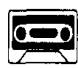
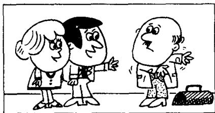

## Lesson 61 A bad cold 重感冒

Listen to the tape then answer this question. What is good news for Jimmy? 听录音，然后回答问题。吉米有什么好消息？

MR. WILLIAMS: Where's Jimmy?
MRS. WILLIAMS: He's in bed.
MR. WILLIAMS: What's the matter with him?
MRS. WILLIAMS: He feels ill.

MR. WILLIAMS : He looks ill.
MRS. WILLIAMS : We must call the doctor.
MR. WILLIAMS : Yes, we must.

MR. WILLIAMS: Can you remember the doctor's telephone number?

MRS. WILLIAMS: Yes.
It's 09754.

DOCTOR : Open your mouth, Jimmy.
Show me your tongue.
Say, ‘Ah’.

MR. WILLIAMS: What's the matter with him, doctor?
DOCTOR: He has a bad cold,
Mr. Williams,
so he must stay in bed
for a week.

MRS. WILLIAMS : That's good news for Jimmy.
DOCTOR : Good news?
Why?
MR. WILLIAMS : Because he doesn't like school!

## New words and expressions 生词和短语

feel /fiːl/ v. 感觉

remember /rɪˈmembə/ v. 记得，记住

look /lʊk/ v. 看 (起来)

mouth /maʊθ/ n. 嘴

must /mʌst/ modal verb 必须

tongue /tʌŋ/ n. 舌头

call /kɔːl/ v. 叫，请

bad /bæd/ adj. 坏的，严重的

doctor /'dɒktə/ n. 医生

cold /kəʊld/ n. 感冒

telephone /'telɪfəʊn/ n. 电话

news /njuːz/ n. 消息

## Notes on the text 课文注释

1 What's the matter with him? 他怎么啦？

What's the matter with ...? 常用来询问人或事物的状况，常作“是否有问题？”“是否有麻烦”讲。

2 feel ill, 觉得病了，feel 是系动词，ill 是表语。注意 feel ill 和 look ill 在意思上的区别；前者指自我感觉，后者指外表形象。

3 It's 09754. 其中 It's 指 “电话号码是”。

4 have a bad cold, 得了重感冒。

5 That's good news 中的 news 是不可数名词，不是复数形式。

6 Good news? 是省略句，完整的句子应为 Is it good news?

## 参考译文

威廉斯先生：吉米在哪儿？

威廉斯夫人：他躺在床上。

威廉斯先生：他怎么啦？

威廉斯夫人：他觉得不舒服。

威廉斯先生：他看上去是病了。

威廉斯夫人：我们得去请医生。

威廉斯先生：是的，一定得请。

威廉斯先生：你还记得医生的电话号码吗？

威廉斯夫人：记得。是09754。

医生：把嘴张开，吉米。让我看看你的舌头。说“啊——”

威廉斯先生：他得了什么病，医生？

医生：他得了重感冒，威廉斯先生，因此他必须卧床一周。

威廉斯夫人：对吉米来说，这可是个好消息。

医生：好消息？为什么？

威廉斯先生：因为他不喜欢上学。
