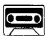
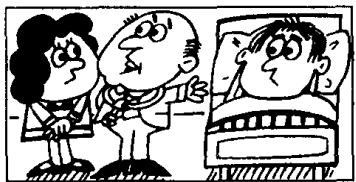

# Lesson 62 What's the matter with them? 他们怎么啦？What must they do? 他们该怎么办？

Listen to the tape and answer the questions.

听录音并回答问题。

41st

  
She has a headache.
So she must take an aspirin.  
52nd

  
George has an earache.
So he must see a doctor.  
63rd

  
He has a toothache.
So he must see a dentist.  
74th

  
Jane has a stomach ache.
So she must take some medicine.  
85th

  
Sam has a temperature.
So he must go to bed.

96th  
  
Dave has flu.
So he must stay in bed.  
107th

  
Jimmy has measles.
So we must call the doctor.  
118th

  
Susan has mumps.
So we must call the doctor.

## New words and expressions 生词和短语

headache /'hedeik/ n. 头痛

medicine /'medɪsɪn/ n. 药

aspirin /'æsprɪn/ n. 阿斯匹林

temperature /'tempərətʃə/ n. 温度

earache /'ɪəreɪk/ n. 耳痛

flu /fluː/ n. 流行性感冒

toothache /'tu:θeɪk/ n. 牙痛

measles /'mi:zəlz/ n. 麻疹

dentist /'dentɪst/ n. 牙医

mumps /mʌmps/ n. 腮腺炎

stomach ache /'stʌmək-eɪk/ 胃痛

## Notes on the text 课文注释

1 take an aspirin 相当于 have an aspirin, 服 (吃) 一片阿斯匹林。

2 have a temperature, 发烧。

## Written exercises 书面练习

A Rewrite these sentences using He.

改写下列句子，用 He 作主语。

## Examples :

I have a headache. He has a headache.

I must stay at home. He must stay at home.

1 I have a cold.

2 I can't go to work.

He \_\_\_\_

The Ground Truth image displays a single, continuous horizontal line, which is a stylistic or background element (like a ruled paper line). According to Rule 2, such lines must be ignored by the OCR result. The provided OCR content is "\_\_\_\_", which consists of underscores. Underscores are not equivalent to a solid line and are not permitted under the “Stylistic/Background Lines (Ignore)” rule. Outputting underscores for a stylistic line is incorrect because it misinterprets the line as a fill-in-the-blank placeholder. Therefore, the OCR result is inconsistent with the Ground Truth.

4 I feel ill.

5 I must see a doctor.

3 I am not well.

The Ground Truth image displays a single, continuous horizontal line, which is a stylistic or background element (like a ruled paper line). According to Rule 2, such lines must be ignored by the OCR result. The provided OCR content is "\_\_\_\_", which consists of underscores. Underscores are not equivalent to a solid line and are not permitted under the “Stylistic/Background Lines (Ignore)” rule. Outputting underscores for a stylistic line is incorrect because it misinterprets the line as a fill-in-the-blank placeholder. Therefore, the OCR result is inconsistent with the Ground Truth.

6 I do not like doctors. \_\_\_\_

## B Write sentences like those in the example.

模仿例句完成以下句子。

## Example :

Jimmy/(a stomach ache)/a headache/take an aspirin

What's the matter with Jimmy?

Does he have a stomach ache?

No, he doesn't have a stomach ache.

He has a headache.

So he must take an aspirin.

1 Elizabeth/(an earache)/a headache/take an aspirin

2 George/(a headache)/an earache/see a doctor

5 Sam/(a stomach ache)/a temperature/go to bed

3 Jim/(a stomach ache)/a toothache/see a dentist

6 Dave/(a headache)/flu/stay in bed

4 Jane/(a toothache)/a stomach ache/take some medicine

7 Jimmy/(a headache)/measles/we . . . call the doctor

8 Susan/(an earache)/mumps/we . . . call the doctor
