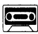
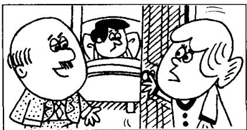

## Lesson 63 Thank you, doctor. 谢谢你，医生。

Listen to the tape then answer this question. Who else is in bed today? Why? 听录音，然后回答问题。还有谁今天也卧床休息？为什么？

DOCTOR: How's Jimmy today?

MRS. WILLIAMS: Better. Thank you, doctor.

DOCTOR : Can I see him please, Mrs. Williams?

MRS. WILLIAMS : Certainly, doctor.
Come upstairs.

DOCTOR : You look very well, Jimmy. You are better now, but you mustn't get up yet. You must stay in bed for another two days.

DOCTOR : The boy mustn't go to school yet, Mrs. Williams. And he mustn't eat rich food.

MRS. WILLIAMS : Does he have a temperature, doctor?

DOCTOR : No, he doesn't.

MRS. WILLIAMS : Must he stay in bed?

DOCTOR : Yes.
He must remain in bed
for another two days.
He can get up
for about two hours each day,
but you must keep the
room warm.

DOCTOR : Where's Mr. Williams this evening?
MRS. WILLIAMS : He's in bed, doctor.
Can you see him please?
He has a bad cold, too!

## New words and expressions 生词和短语

better /'betə/ adj. 形容词 well 的比较级

rich / rɪtʃ/ adj. 油腻的

certainly /'sɜːtnli/ adv. 当然

food /fuːd/ n. 食物

get up 起床

remain /rɪˈmeɪn/ v. 保持，继续

yet /jet/ adv. 还，仍

## Notes on the text 课文注释

1 He's better.

在英文中，如果将一个人或物等与另一个人或物等进行比较，就可以用比较级。在这句话中，威廉斯夫人是把吉米今天的状况和前几天相比。形容词well的比较级形式不规则，意思是“健康状况有所好转”。

2 come upstairs, 上楼，此处 upstairs 是副词。

3 ... you mustn't get up yet.

yet 这个词一般用于否定句。get up 表示起床，在英语中有不少动词常与介词或副词连用，组成一个词组，称为动词短语，如 get up 就是一个动词短语。

4 for another two days,

for 引导的表示时间的短语往往可以译作 “达”，“计”。本课中 for about two hours each day 可译为 “每天可达两小时”。each day 是 “每天” 的意思。

5 keep the room warm, 使房间保持暖和。

## 参考译文

医生：吉米今天怎么样了？

威廉斯夫人：他好些了。谢谢您，医生。

医生：我可以看看他吗，威廉斯夫人？

威廉斯夫人：当然可以，医生。上楼吧。

医生：你看上去很好，吉米。你现在好些了，但你还不应该起床。你必须再卧床两天。

医生：这孩子还不能去上学，威廉斯夫人，而且不能吃油腻的食物。

威廉斯夫人：他还发烧吗，医生？

医生：不，他不发烧了。

威廉斯夫人：他还必须卧床吗？

医生：是的，他还必须卧床两天。他每天可以起来两个小时，但您必须保持房间温暖。

医生：威廉斯先生今晚去哪儿了？

威廉斯夫人：他在床上呢，医生。您能看看他吗？他也得了重感冒！
