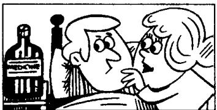
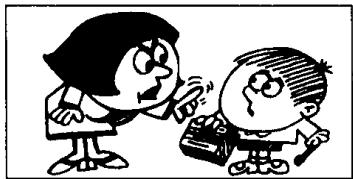
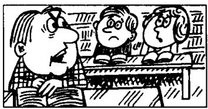

# Lesson 64 Don't...! 不要……! You mustn't...! 你不应该……!

Listen to the tape and answer the questions.
听录音并回答问题。

110

  
...take any  
aspirins!  
221

  
... take this medicine!  
332

  
... call the  
doctor!  
443

  
... play with matches!  
554

  
... talk in the  
library!  
665

  
... make a noise!  
776  
... drive so quickly!

  
887

  
... lean out of
the window!  
998

  
... break that vase!

## New words and expressions 生词和短语

play /pleɪ/ v. 玩

so /səʊ/ adv. 如此地

match /mætʃ/ n. 火柴

quickly /'kwɪkli/ adv. 快地

talk /tɔːk/ v. 谈话

lean out of 身体探出

library /'laɪbrəri/ n. 图书馆

drive /draɪv/ v. 开车

break /breɪk/ v. 打破

noise /nɔɪz/ n. 喧闹声

## Notes on the text 课文注释

1 play with matches, 玩火柴。

2 make a noise 指 “弄出噪音”，“发出响声”。

## Written exercises 书面练习

A Rewrite these sentences using Jimmy.
改写以下句子，用 Jimmy 作主语。

## Example :

I mustn't take any aspirins.
Jimmy mustn't take any aspirins.

1 I am better now but I mustn't get up yet.

2 I have a cold and I must stay in bed.

3 I can get up for two hours each day.

4 I often read in bed.

5 I listen to the stereo, too.

6 I don't feel ill now.

B Complete these sentences.
模仿例句完成以下句子。

## Example :

\_\_\_\_ eat rich food!

Don't eat rich food!

You mustn't eat rich food!

1 \_\_\_\_ take any aspirins!

6 \_\_\_\_ make a noise!

2 \_\_\_\_ take this medicine!

7 \_\_\_\_ drive so quickly!

3 \_\_\_\_ call the doctor!

8 \_\_\_\_ lean out of the window!

4 \_\_\_\_ play with matches!

9 \_\_\_\_ break that vase!

5 \_\_\_\_ talk in the library!
