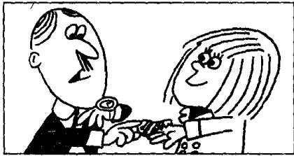

## Lesson 65 Not a baby 不是一个孩子

Listen to the tape then answer this question.

Does Jill take the key to the front door?

听录音，然后回答问题。吉尔有没有拿到大门的钥匙？

FATHER: What are you going to do this evening, Jill?

JILL: I'm going to meet some friends, Dad.

FATHER: You mustn't come home late.  
You must be home at half past ten.

JILL: I can't get home so early, Dad!

JILL : Can I have the key to the front door, please?

FATHER: No, you can't.

MOTHER : Jill's eighteen years old, Tom.
She's not a baby.
Give her the key.
She always comes home early.

FATHER : Oh, all right!

FATHER: Here you are. But you mustn't come home after a quarter past eleven. Do you hear?

JILL: Yes, Dad.

JILL : Thanks, Mum.

MOTHER : That's all right. Goodbye. Enjoy yourself!

JILL : We always enjoy ourselves, Mum. Bye-bye.

## New words and expressions 生词和短语

Dad /dæd/ n. 爸 (儿语)

enjoy /ɪnˈdʒɔɪ/ v. 玩得快活

key /kiː/ n. 钥匙

yourself /jɔː'self/ pron. 你自己

baby /'beɪbi/ n. 婴儿

ourselves /ˌaʊəˈselvz/ pron. 我们自己

hear /hɪə/ v. 听见

mum /mʌm/ n. 妈妈

## Notes on the text 课文注释

1 the key to the front door,

to the front door 是介词短语，作定语，修饰 key。

2 a quarter past eleven, 11 点 1 刻，past 是介词。

3 Enjoy yourself! 好好玩吧。在 enjoy 这个动词后面往往有一个反身代词，如 yourself, ourselves, himself, herself 等。

## 参考译文

父亲：今晚你打算干什么，吉尔？

吉尔：我打算去看几个朋友，爸爸。

父亲：你不准回家太晚，你必须在10点半到家。

吉尔：这么早我到不了家，爸爸！

吉尔：我能带上前门的钥匙吗？

父亲：不行，你不能带。

母亲：吉尔都18岁了，汤姆。她不是小孩子了。把钥匙给她吧。她总是早早回家的。

父亲：那么，好吧！

父亲：拿去。但你不能超过11点1刻回家。听见了吗？

吉尔：听见了，爸爸。

吉尔：谢谢，妈妈。

母亲：不用谢。再见。好好玩吧！

吉尔：我们总是玩得很开心的，妈妈。再见。
