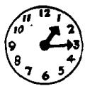
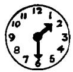
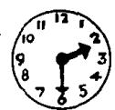
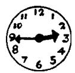
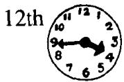
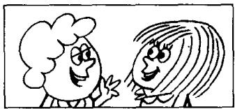

## Lesson 66 What's the time? 几点钟?

Listen to the tape and answer the questions.
听录音并回答问题。

1st

2nd

3rd

4th

5th

7th

8th

6th

## When's your birthday? 你的生日是哪一天？

## How old are you? 你多大了?

<table><tr><td colspan="6">JULY</td></tr><tr><td>S</td><td></td><td>7</td><td>14</td><td>21</td><td>28</td></tr><tr><td>M</td><td>1</td><td>8</td><td>15</td><td>22</td><td>29</td></tr><tr><td>TU</td><td>2</td><td>9</td><td>16</td><td>23</td><td>30</td></tr><tr><td>W</td><td>3</td><td>10</td><td>17</td><td>24</td><td>31</td></tr><tr><td>TH</td><td>4</td><td>11</td><td>18</td><td>25</td><td></td></tr><tr><td>F</td><td>5</td><td>12</td><td>19</td><td>26</td><td></td></tr><tr><td>S</td><td>6</td><td>13</td><td>20</td><td>27</td><td></td></tr></table>

## Enjoy yourself! 你好好玩吧!

13th

  
Enjoy yourself!

I always enjoy myself.

14th

  
We're enjoying ourselves.

They're enjoying themselves.

15th

  
He's enjoying himself.  
16th

  
She's enjoying herself.

## New words and expressions 生词和短语

myself /mar'self/ pron. 我自己
themselves /ðəm'selvz/ pron. 他们自己himself /hɪm'self / pron. 他自己

herself /hɜːˈself/pron. 她自己

## Written exercises 书面练习

A Complete these sentences using in, at or from.

用 in, at 或 from 完成以下句子。

1 I am going to see him \_\_\_\_ ten o'clock.

2 It often rains \_\_\_\_ November.

3 Where do you come \_\_\_\_ ? I come \_\_\_\_ France.

4 I always go to work \_\_\_\_ the morning.

5 What's the climate like \_\_\_\_ your country?

6 It's cold \_\_\_\_ winter and hot \_\_\_\_ summer.

B Answer these questions using l/you/he/she/we/they and . . . o'clock, a quarter to . . . , past . . . , half past . . .

模仿例句回答问题。

Example :

When must you come home? (1.00)

I must come home at one o'clock.

1 When must she go to the library? (1.15)

2 When must you and Sam see the dentist? (3.45)

3 When must you type this letter? (2.00)

4 When must Sam and Penny see the boss? (1.30)

5 When must George take his medicine? (3.15)

6 When must Sophie arrive in London? (2.30)

7 When must I catch the bus? (3.30)

8 When must you arrive there? (3.00)

9 When must they come home? (2.15)

10 When must you meet Sam? (1.45)

11 When must he telephone you? (2.45)
