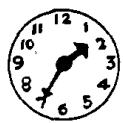
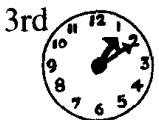
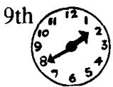
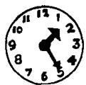
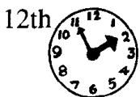
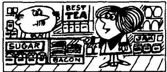

# Lesson 68 What's the time? 几点钟?

Listen to the tape and answer the questions.

听录音并回答问题。

  
2nd

  
8th

  
5th

  
6th

Where were you on ...? ……你在什么地方？

When were you at...? 你什么时候在……?

Sunday, January 1st

  
church  
Monday, February 2nd

  
school  
Tuesday, March 3rd

  
the office  
Wednesday, April 4th

  
the butcher's  
Thursday, May 5th

  
the hairdresser's  
Friday, June 6th

  
the baker's  
Saturday, July 7th

  
the dairy  
Sunday, August 8th

  
home  
Monday, September 9th

  
Tuesday, October 10th  
the grocer's

  
the greengrocer's

## New words and expressions 生词和短语

church /tʃ3ːtʃ/ n. 教堂

baker /'beɪkə/ n. 面包师傅

dairy /'deəri/ n. 乳品店

grocer/ˈgrəʊsə/ n. 食品杂货商

## Written exercises 书面练习

A Complete these sentences using the where necessary.

完成以下句子，必要时填上定冠词 the。

I was at \_\_\_\_ church on Sunday.

2 I was at \_\_\_\_ office on Monday.

3 My son was at \_\_\_\_ school on Tuesday.

4 My wife was at \_\_\_\_ butcher's on Wednesday.

5 She was at \_\_\_\_ grocer's on Thursday.

6 My daughter was in \_\_\_\_ country on Friday.

7 I was at \_\_\_\_ home on Saturday.

B. Write questions and answers using he/she and at/on.

模仿例句提问并回答。

Example :

he/church/Sunday

When was he at church?

He was at church on Sunday.

1 Tom/the hairdresser's/Thursday

2 Mrs. Jones/the butcher's/Wednesday

3 he/home/Sunday

4 Penny/the baker's/Friday

5 Mrs. Williams/the grocer's/Monday

6 Nicola/the office/Tuesday
