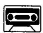
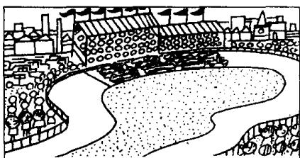
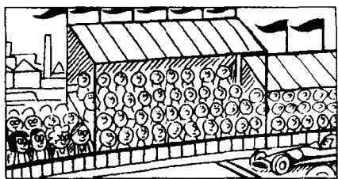
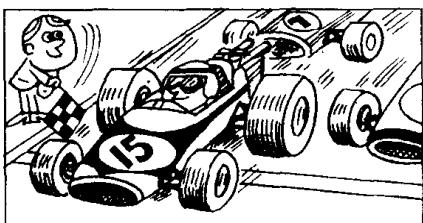

## Lesson 69 The car race 汽车比赛

Listen to the tape then answer this question.

Which car was the winner in 1995?

听录音，然后回答问题。哪辆车在1995年的比赛中获胜？

There is a car race
near our town every year.
In 1995,
there was a very big race.

There were hundreds of people there. My wife and I were at the race. Our friends Julie and Jack were there, too. You can see us in the crowd. We are standing on the left.

There were twenty cars in the race.
There were English cars, French cars,
German cars, Italian cars,
American cars and Japanese cars.

It was an exciting finish.  
The winner was Billy Stewart.  
He was in car number fifteen.  
Five other cars were just behind him.

On the way home,
my wife said to me,
'Don't drive so quickly!
You're not Billy Stewart!'

## New words and expressions 生词和短语

year /jɪə/ n. 年

just /dʒʌst/ adv. 正好，恰好

race /reis/ n. 比赛

finish /'fɪnɪʃ/ n. 结尾，结束

town /taʊn/ n. 城镇

winner /'wɪnə/ n. 获胜者

crowd /kraʊd/ n. 人群

behind /bɪˈhaɪnd/ prep. 在……之后

stand /stænd/ v. 站立

way /weɪ/ n. 路途

exciting /ɪkˈsaɪtɪŋ/ adj. 使人激动的

## Notes on the text 课文注释

1 hundreds of ..., 数以百计的……，用来表示不确定数量的复数形式。

2 On the way home, 在回家的途中。on the way 是指 “在……的途中”。

## 参考译文

在我们镇子附近每年都有一场汽车比赛。1995年举行了一次盛大的比赛。

许许多多人都去了赛场。我和我的妻子也去了。我们的朋友朱莉和杰克也去了。你可以在人群中看到我们。我们站在左面。

参加比赛的有20辆汽车。有英国、法国、德国、意大利、美国和日本的汽车。

比赛的结尾是激动人心的。获胜者是比利·斯图尔特。他在第15号车里，其他5辆汽车紧跟在他后面。

在回家的途中，我妻子对我说：“别开得这样快！你可不是比利·斯图尔特！”
