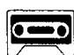
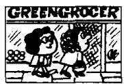
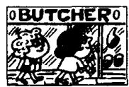
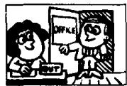
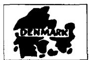
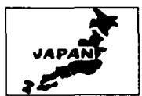

## Lesson 70 When were they there? 他们是什么时候在那里的？

Listen to the tape and answer the questions.

听录音并回答问题。

ON

Monday

  
At:  
Tuesday

  
Wednesday

  
Thursday

  
Friday

  
Saturday

  
ON  
Jan. 21st

  
Feb. 22nd  
At:

  
March 23rd

  
April 24th

  
May 25th

  
June 26th

  
In:  
July

  
August

  
September

  
October

  
November

  
December

  
IN  
1985  
In:

  
1987

  
1990

  
1994

  
1996

# New words and expressions 生词和短语

stationer /'steiʃənə/ n. 文具商

Denmark /'denma:k/ n. 丹麦

Written exercises 书面练习

A Complete these sentences using at, on or in.

完成以下句子，用适当的介词填空。

1 We were \_\_\_\_ the stationer's \_\_\_\_ Monday.

2 We were there \_\_\_\_ four o'clock.

3 They were \_\_\_\_ Australia \_\_\_\_ September.

4 They were there \_\_\_\_ spring.

5 \_\_\_\_ November 25th, they were \_\_\_\_ Canada.

6 They were there \_\_\_\_ 1990.

B Write questions and answers using we/they and at/in/on.

模仿例句提问并回答，选用 we 或 they 作主语，介词可选用 at, in 或 on。

Examples :

Sam and Penny/the stationer's /Monday

Where were Sam and Penny on Monday?

They were at the stationer's on Monday.

you and Penny/Australia/July

Where were you and Penny in July?

We were in Australia in July.

1 you and Susan/the office/March 23rd

5 you and Penny/Austria/August

2 Sam and Penny/India/1986

6 Sam and Penny/home/May 25th

3 you and Penny/the baker's/Saturday

7 you and Penny/Finland/December

4 Sam and Penny/Canada/1993

8 you and Sam/school/February 22nd
