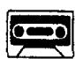
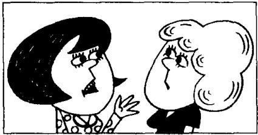
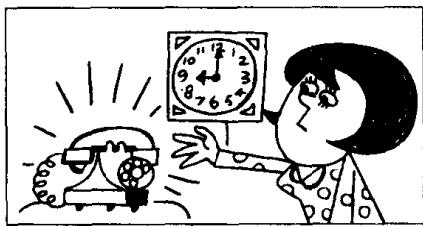

## Lesson 71 He's awful! 他讨厌透了!

Listen to the tape then answer this question.

How did Pauline answer the telephone at nine o'clock?

听录音，然后回答问题。波琳在9点接电话时是如何说的？

JANE: What's Ron Marston like, Pauline?

PAULINE: He's awful!  
He telephoned me  
four times yesterday,  
and three times  
the day before yesterday.

PAULINE : He telephoned the office yesterday morning and yesterday afternoon. My boss answered the telephone.

JANE : What did your boss say to him?

PAULINE: He said, 'Pauline is typing letters. She can't speak to you now!'

PAULINE : Then I arrived home
at six o'clock yesterday evening.
He telephoned again.
But I didn't answer the phone!

JANE : Did he telephone again last night?

PAULINE: Yes, he did.
He telephoned at nine o'clock.

JANE: What did you say to him?

PAULINE : I said, 'This is Pauline's mother. Please don't telephone my daughter again!'

JANE : Did he telephone again?

PAULINE: No, he didn't!

## New words and expressions 生词和短语

awful /'ɔːfəl/ adj. 让人讨厌的，坏的

last /laːst/ adj. 最后的，前一次的

telephone /'telɪfəʊn/ v. & n. 打电话；电话

phone /fəʊn/ n. 电话 (= telephone)

time /taɪm/ n. 次 (数)

answer /'ɑːnsə/ v. 接 (电话)

again /ə'gen/ adv. 又一次地

say /seɪ/ (said /sed/) v. 说

## Notes on the text 课文注释

He telephoned me four times yesterday. 他昨天给我打了 4 次电话。“是”动词以外的动词在过去时中一般有两种形式。规则动词一般是在动词后面加 -ed, 如 answer/answered; 以 -e 结尾的规则动词加 -d. 如 telephone/telephoned, arrive/arrived。另一部分动词的过去式拼写不规则，因此称为不规则动词，如 say/said, do/did。从本课开始，单词表中的不规则动词除列出原形外，还将在括弧中列出过去式的拼写和读音。

2 一般过去时的句子中常常有表示过去某一时刻的时间状语，如本课中的 yesterday（昨天），the day before yesterday（前天），yesterday morning（昨天上午），yesterday afternoon（昨天下午），yesterday evening（昨天晚上），last night（昨夜）。

## 参考译文

简：波琳，朗·马斯顿是怎样一个人？

波琳：他讨厌透了！他昨天给我打了4次电话。前天打了3次。

波琳：他昨天上午和下午把电话打到了我的办公室，是我的老板接的。

简：你老板是怎么对他说的？

波琳：他说：“波琳正在打信，她现在不能同你讲话！”

波琳：后来，我昨晚6点钟回到家里。他又打来电话，但我没接。

简：他昨天夜里又打电话了吗？

波琳：是的，打了。他在9点钟又打来了电话。

简：你对他怎么说的？

波琳：我说：“我是波琳的母亲。请不要再给我女儿打电话了！”

简：他又打了没有？

波琳：没有！

9th

1st
