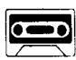
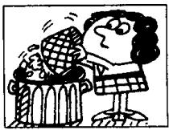

## Lesson 72 When did you ...? 你什么时候……?

Listen to the tape and answer the questions.

听录音并回答问题。

TODAY

this morning

YESTERDAY

yesterday morning

THE DAY BEFORE YESTERDAY

the day before yesterday

this afternoon

yesterday afternoon

in the morning

the day before yesterday

this evening

yesterday evening

in the afternoon

the day before yesterday

tonight

last night

in the evening

the night before last

aired

2nd

  
cleaned

3rd

  
opened

4th

  
sharpened  
5th

  
turned on  
6th  
listened

7th

  
boiled

8th

  
arrived

  
played  
10th

  
stayed  
11th  
shaved

  
12th  
climbed

  
13th

  
telephoned  
14th  
called

  
15th  
emptied

Written exercises 书面练习、

A Complete these sentences.
模仿例句完成以下句子。

Example :

She is airing the room now. She \_\_\_\_ it yesterday.

She aired it yesterday.

1 It is raining now. It \_\_\_\_ yesterday.

2 It is snowing now. It \_\_\_\_ yesterday.

3 He is boiling some eggs. He \_\_\_\_ some yesterday.

4 We are enjoying our lunch. We \_\_\_\_ it yesterday, too.

B Write questions and answers.

模仿例句提问并回答。

Example :

she/air the room/yesterday

What did she do yesterday?

She aired the room yesterday.

1 they/clean their shoes/yesterday

2 he/open the box/last night

3 they/sharpen their pencils/this morning

4 she/turn on the television/this evening

5 she/listen to the radio/last night

6 she/boil an egg/yesterday morning

7 they/play a game/yesterday afternoon

8 he/stay in bed/the day before yesterday/in the morning

9 she/telephone her husband/yesterday evening

10 she/call the doctor/the night before last

## Can you do this test?

## 你能完成以下测试吗？

I Dictation.

听写。

## II Look at this:

阅读以下例句：

I am tired.

He is tired.

## Write these again. Begin each sentence with He.

改写下面的句子，用 $He$ 作句子的主语。

1 I must call the doctor.

2 I am going to telephone him.

3 I can go with her.

4 I have a new car.

5 I come from America.

6 I am American.

7 I like ice cream.

8 I want a newspaper.

9 I was at school yesterday.

10 I don't live here.

## III Look at this:

阅读以下例句：

There is a pencil on the desk.

There are some pencils on the desk.

Write these again. Begin each sentence with There are ...

改写下面的句子，将 There are 置于句首。

1 There is a watch on the table.

6 There is a peach on the desk.

2 There is a knife near that tin.

7 There is a passport on the shelf.

3 There is a policeman in the kitchen.

8 There is a fish in the cupboard.

4 There is a cup on the table.

9 There is a tree in the garden.

5 There is a letter on the shelf.

10 There is a boat on the river.

## IV Put in a, some or any:

用 $a$ , some 或 any 填空:

I have \_\_\_\_ new car.

6 I want \_\_\_\_ loaf of bread, please.

2 There are \_\_\_\_ clouds in the sky.

7 Do you want \_\_\_\_ bread?

3 There is \_\_\_\_ milk in the bottle.

8 No, I don't want \_\_\_\_ bread.

4 Is there \_\_\_\_ chocolate on the shelf?

9 I want \_\_\_\_ tea

5 There is \_\_\_\_ bar of chocolate on the table.

10 I want \_\_\_\_ biscuits, too.

V Put in in, at, from or on:

用 in, at, from 或 on 填空:

1 He is going to telephone \_\_\_\_ five o'clock.

2 My birthday is \_\_\_\_ May 21st.

3 It is always cold \_\_\_\_ February.

4 She isn't French. She comes \_\_\_\_ Spain.

5 My father was there \_\_\_\_ 1942.

6 Were you \_\_\_\_ school yesterday?

7 He doesn't live here. He lives \_\_\_\_ England.

8 They always do their homework \_\_\_\_ the evening.

9 Can you come \_\_\_\_ Monday?

10 She's not here. She's \_\_\_\_ the butcher's.

VI Put in across, over, between, off, along, in, on, into, out of, or under: 用 across, over, between, off, along, in, on, into, out of 或 under 填空:

1 The aeroplane is flying \_\_\_\_ the village.

2 The ship is going \_\_\_\_ the bridge.

3 The boy is swimming \_\_\_\_ the river.

4 Two cats are running \_\_\_\_ the wall.

5 My books are \_\_\_\_ the shelf.

6 The bottle of milk is \_\_\_\_ the refrigerator.

7 The boy is jumping \_\_\_\_ the branch.

8 Mary is sitting \_\_\_\_ her mother and her father.

9 It is 9.0 o'clock. The children are going \_\_\_\_ class.

10 It is 4.0 o'clock. The children are coming \_\_\_\_ class.

## VII Look at this:

阅读以下例句：

<table><tr><td>Take ...</td><td>He is taking his book.</td></tr></table>

Do these in the same way:

模仿例句完成以下句子:

1 Make ... She is \_\_\_\_ the bed.

2 Swim ... They are \_\_\_\_ across the river.

3 Shine ... The sun is \_\_\_\_

4 Shave ... My father is \_\_\_\_

5 Run ... They are \_\_\_\_ across the park.

6 Sit ... She is \_\_\_\_ in an armchair.

7 Type ... We are \_\_\_\_ letters.

8 Put ... He is \_\_\_\_ on his coat.

9 Come ... I am \_\_\_\_

10 Give ... I am \_\_\_\_ it to him.

## VIII Look at this:

阅读以下例句：

<table><tr><td></td><td>He is sitting in an armchair.</td></tr><tr><td>QUESTION:</td><td>Is he sitting in an armchair?</td></tr><tr><td>QUESTION:</td><td>Where is he sitting?</td></tr><tr><td>NEGATIVE:</td><td>He isn&#x27;t sitting in an armchair.</td></tr></table>

Do these in the same way:

模仿例句提问, 并作出否定的回答:

1 He can come now.

2 There is a newspaper on the desk.

Q:

Q:

Q: When \_\_\_\_

Q: What

N:

N: \_\_\_\_

3 He wants a new car.

4 He is going to come now.

Q:

Q:

Q: What \_\_\_\_

N: \_\_\_\_

Q: When

N: \_\_\_\_

5 They like ice cream.

Q:

Q: What \_\_\_\_

N:

7 They must go home now.

Q:

Q: When \_\_\_\_

N: \_\_\_\_

9 He has a headache.

Q: \_\_\_\_

Q: What

N:

6 He comes from Germany.

Q: \_\_\_\_

Q: Where \_\_\_\_

N:

8 He feels ill.

Q: \_\_\_\_

Q: How

N: \_\_\_\_

10 He cleaned his shoes.

Q: \_\_\_\_

Q: When \_\_\_\_

N: \_\_\_\_
