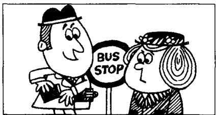

## Lesson 73 The way to King Street 到国王街的走法

Listen to the tape then answer this question.

Why did the man need a phrasebook?

听录音，然后回答问题。为什么这位男士需要一本常用语手册？

Last week Mrs. Mills went to London.
She does not know London very well,
and she lost her way.

Suddenly, she saw a man near a bus stop.
'I can ask him the way,' she said to herself.

'Excuse me,' she said. 'Can you tell me the way to King Street, please?'

The man smiled pleasantly.  
He did not understand English!  
He spoke German.  
He was a tourist.

Then he put his hand
into his pocket,
and took out a phrasebook.

He opened the book and found a phrase. He read the phrase slowly. 'I am sorry,' he said. 'I do not speak English.'

## New words and expressions 生词和短语

week /wiːk/ n. 周

London /'lʌndən/ n. 伦敦 speak /spiːk/ (spoke /spəʊk/) v.
讲，说

suddenly /'sʌdnli/ adv. 突然地

bus stop /'bʌs-stop/ 公共汽车车站

hand /hænd/ n. 手

smile /smaɪl/ v. 微笑

pocket /'pɒkɪt/ n. 衣袋

pleasantly /'plesəntli/ adv. 愉快地

phrasebook /'freizbuk/ n. 短语手册，常用语手册

understand /ˌʌndəˈstænd/ (understood /ˌʌndəˈstʊd/)

phrase /'freiz/ n. 短语 ·

v. 懂. 明白

slowly /'sləʊli/ adv. 缓慢地

## Notes on the text 课文注释

1 . . . , and she lost her way. ……因此她迷路了。

句中的 and 当 “所以” 讲，表示结果。

2 she said to herself, 她心中暗想。

## 参考译文

上星期米尔斯夫人去了伦敦。她对伦敦不很熟悉，因此迷了路。

突然，她在公共汽车站附近看到一个男人。“我可以向他问路，”她想。

“对不起，您能告诉我到国王街怎么走吗？”她说。

这人友好地笑了笑。他不懂英语！他讲德语。他是个旅游者。

然后他把手伸进了衣袋，掏出了一本常用语手册。

他翻开书找到了一条短语。他缓慢地读着短语。

“很抱歉，”他说，“我不会讲英语。”
