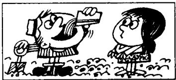
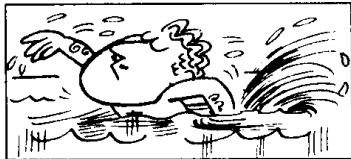

## Lesson 74 What did they do? 他们干了什么？

Listen to the tape and answer the questions.

听录音并回答问题。

101

  
He shaved hurriedly
this morning and
cut himself badly.  
102

  
He took a cake
and ate it quickly.

103  
  
I gave him a glass of water and he drank it thirstily.  
104

  
I met her in the street
the day before yesterday.
and she greeted me warmly.

105  
  
The bus went slowly yesterday afternoon and we arrived home late.

106  
  
They worked very hard this morning.  
107

  
We enjoyed ourselves
very much last night.

108  
  
He swam very well this afternoon.

## New words and expressions 生词和短语

hurriedly /'hʌridli' adv. 匆忙地

go /gəʊ/ (went /went/) v. 走

cut /kʌt/ (cut) v. 制. 切

greet /griːt/ v. 问候，打招呼

thirstily 03:stili adv. 11渴地

## Written exercises 书面练习

A Look at this.

注意下面的词。

quick — quickly: thirsty — thirstily; careful — carefully

Example :

She smiled \_\_\_\_. (pleasant)

She smiled pleasantly.

Complete these sentences.

模仿例句完成以下句子。

1 He read the phrase \_\_\_\_. (slow)

2 He worked \_\_\_\_. (lazy)

4 He worked \_\_\_\_. (careful)

5 The door opened \_\_\_\_. (sudden)

3 He cut himself \_\_\_\_. (bad)

## B Look at this table:

注意下表：

<table><tr><td rowspan="3"></td><td colspan="2">does not know</td><td>very hard</td></tr><tr><td colspan="2">read</td><td>hurriedly</td></tr><tr><td colspan="2">smiled</td><td>slowly</td></tr><tr><td>He</td><td>went</td><td>a glass of water</td><td>very well</td></tr><tr><td>She</td><td>shaved</td><td>the phrase</td><td>thirstily</td></tr><tr><td>We</td><td>drank</td><td>me</td><td>warmly</td></tr><tr><td rowspan="3">The bus</td><td>greeted</td><td>London</td><td>pleasantly</td></tr><tr><td>worked</td><td></td><td>very much</td></tr><tr><td>enjoyed ourselves</td><td></td><td></td></tr></table>

Now write eight sentences.

模仿下面的例句，从上面的表格中选出恰当的词和词组，写出8句话。

Example:

He read the phrase slowly.
