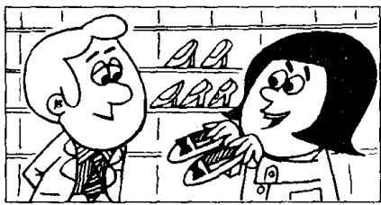

## Lesson 75 Uncomfortable shoes 不舒适的鞋子

Listen to the tape then answer this question. What's wrong with the fashionable shoes? 听录音，然后回答问题。这些时髦的鞋有什么毛病？

LADY : Do you have any shoes like these?

SHOP ASSISTANT : What size?

LADY : Size five.

SHOP ASSISTANT : What colour?

LADY : Black.

SHOP ASSISTANT: I'm sorry. We don't have any.

LADY : But my sister bought this pair last month.

SHOP ASSISTANT : Did she buy them here?

LADY : No, she bought them in the U.S.

SHOP ASSISTANT: We had some shoes like those a month ago, but we don't have any now.

LADY : Can you get a pair for me, please?

SHOP ASSISTANT: I'm afraid that I can't. They were in fashion last year and the year before last. But they're not in fashion this year.

SHOP ASSISTANT : These shoes are in fashion now.

LADY : They look very uncomfortable.

SHOP ASSISTANT : They are very uncomfortable.
But women always wear
uncomfortable shoes!

## New words and expressions 生词和短语

ago /əˈɡəʊ/ adv. 以前

fashion /'fæʃən/ n. （服装的）流行式样

buy /baɪ/ (bought /bɔːt/) v. 买

pair /peə/ n. 双，对

uncomfortable /ʌnˈkʌmftəbəl/ adj. 不舒服的

wear /weə/ (wore /wɔː/) v. 穿着

## Notes on the text 课文注释

I like these 是介词短语作定语，修饰 shoes。意思是“像这样的鞋子”。

2 We don't have any.

any 后面省略了 black shoes。

3 ago 放在表示时间长度的短语的后面，常与表示一般过去时的动词连用。如 a month ago（一个月之前）。

4 in fashion, 流行的，时髦的。

5 I'm afraid ... 我恐怕……。

## 参考译文

女士：像这样的鞋子你们有吗？

售货员：什么尺码的？

女士：5号的。

售货员：什么颜色？

女士：黑的。

售货员：对不起，我们没有。

女士：但是，我姐姐上个月买到了这样的一双。

售货员：她是在这儿买的吗？

女士：不。她是在美国买的。

售货员：一个月前我们有这样的鞋，但是现在没有了。

女士：您能为我找一双吗？

售货员：恐怕不行。这鞋在去年和前年时兴，而今年已不流行了。

售货员：现在流行的是这种鞋子。

女 上：这种鞋子看上去很不舒适。

售货员：的确很不舒适。可是女人们总是穿不舒适的鞋子！

111

112

121

117
