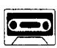
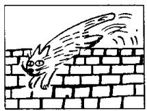
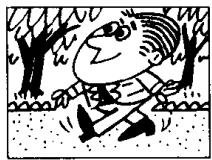
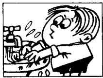
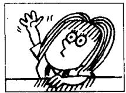
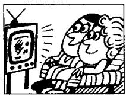
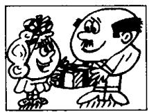
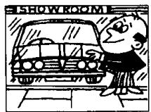
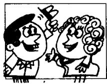

## Lesson 76 When did you ...? 你什么时候……?

Listen to the tape and answer the questions.
听录音并回答问题。

<table><tr><td>this week</td><td></td><td>last week</td><td>the week before last</td></tr><tr><td>this month</td><td></td><td>last month</td><td>the month before last</td></tr><tr><td>this year</td><td></td><td>last year</td><td>the year before last</td></tr><tr><td>a minute</td><td></td><td></td><td>two minutes</td></tr><tr><td>an hour</td><td></td><td></td><td>five hours</td></tr><tr><td>a day</td><td>AGO</td><td></td><td>three days AGO</td></tr><tr><td>a week</td><td></td><td></td><td>two weeks</td></tr><tr><td>a month</td><td></td><td></td><td>four months</td></tr><tr><td>a year</td><td></td><td></td><td>six years</td></tr></table>

109  
looked

  
at a photograph  
110

  
jumped  
off the wall

  
walked  
across the park

  
washed  
his hands  
113

  
worked
in an office

114

  
asked  
a question  
115

  
typed  
those letters  
116

  
watched  
television

  
talked  
to the salesman  
118

  
thanked  
her father

119

  
dusted  
the cupboard  
120

  
painted
that bookcase

  
waited
at the bus stop  
122

  
wanted
a car like that one  
123

  
greeted  
her

## Written exercises 书面练习

A Rewrite these sentences.

模仿例句将以下句子改成过去时。

## Example :

She goes to town every day. She went to town yesterday.

1 She meets her friends every day.

2 They drink some milk every day.

3 He swims in the river every day.

4 She takes him to school every day.

5 He cuts himself every morning.

B Write questions and answers.
模仿例句提问并回答。

## Example :

look at that photograph/an hour ago

When did you look at that photograph?

I looked at that photograph an hour ago.

I walk across the park/last week

2 wash your hands/a minute ago

3 work in an office/the year before last

4 ask a question/five minutes ago

5 type those letters/a month ago

6 watch television/every day this week

7 talk to the shop assistant/last month

8 thank your father/an hour ago

9 dust the cupboard/three days ago

10 paint that bookcase/the year before last

I I want a car like that one/a year ago

12 greet her/a minute ago
